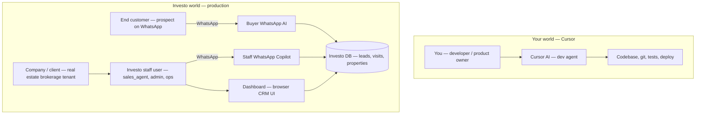

# AI Surfaces — Investo Agent Map (vs Cursor Dev Agent)

> **Investo term (two words):** **AI Surfaces**  
> Everything below — who talks to whom, through which channel, with which logic — is the **AI Surfaces** map.  
> Investo is not one bot; it is several bounded surfaces sharing one database.

**Last updated:** 2026-06-07  
**Related:** `AI_MASTER_REALITY_AND_A_PLUS_PLAN.md`, `fix.md`, `inboundWhatsAppRouting.service.ts`

---

## 0. Two-word answer

| Question | Answer |
|----------|--------|
| What do we call all of this in Investo? | **AI Surfaces** |
| What is the one-line definition? | The full map of **who** uses AI, **where** (channel), and **how** (pipeline + rules). |

**AI Surfaces** covers:

- Buyer WhatsApp AI, staff WhatsApp copilot, dashboard, automation, property import, LangGraph fallback  
- Identity routing (phone → buyer vs copilot vs static handoff)  
- Tenant boundaries, RBAC, takeover, mutation guards  
- How this differs from the **Cursor dev agent** (you ↔ me in the IDE)

---

## 1. Executive summary

| | **Cursor AI (dev agent)** | **Investo AI (production)** |
|---|---|---|
| **Job** | Help you build, debug, and ship Investo | Run real-estate conversations and CRM actions in production |
| **Domain** | General — code, docs, any task | Real estate only — leads, properties, visits, brochures, escalation |
| **Primary channel** | Cursor chat + IDE tools (files, shell, browser) | **WhatsApp** (text, buttons, lists, media) |
| **Primary users** | You (developer / product owner) | Buyers (prospects), staff (agents/admins), companies (tenants) |
| **UI** | Full IDE — read/write codebase | **Buyer: zero UI** (WhatsApp only). Staff: WhatsApp copilot + CRM dashboard (view/config, not main AI brain) |
| **Truth rule** | Should verify with tools/tests | **Must not claim success unless DB/tool succeeded** — production trust requirement |

Same engine shape:

```
message in → rules + context → (optional tools/actions) → reply out
```

Investo wraps that in many hard layers the dev agent does not have.

---

## 2. Who is who — sides explained



### Term glossary

| Term | Who it is |
|------|-----------|
| **Your side / Cursor user** | You — building Investo in the IDE |
| **Dev agent side (me)** | Cursor agent — no tenant, no CRM, no WhatsApp webhook |
| **Investo staff user** | Logged-in platform user: `sales_agent`, `company_admin`, `operations`, `super_admin`, `viewer` |
| **Company / client (tenant)** | Real estate brokerage that pays for Investo — data scoped by `companyId` |
| **End customer / buyer / lead** | Prospect messaging the company WhatsApp number — usually no dashboard login |
| **Investo product** | The whole system: backend, dashboard, WhatsApp integrations, AI pipelines |

**Note:** “Client” is overloaded. In sales it means the **brokerage (tenant)**. In CRM it often means the **buyer/lead**. Investo separates them via **phone routing** and **roles**.

---

## 3. The six AI Surfaces inside Investo

From `AI_MASTER_REALITY_AND_A_PLUS_PLAN.md` — six surfaces share databases; only two are full conversational WhatsApp agentic paths.

| # | Surface | Users | Agentic? | Typical grade |
|---|---------|-------|----------|---------------|
| 1 | **Buyer WhatsApp AI** | Prospects (unknown phones) | Workflows + policy/LLM dual brain | B |
| 2 | **Staff WhatsApp Copilot** | `sales_agent`, `company_admin`, `operations`, `super_admin`, `viewer` | Deterministic → workflows → intents → LangGraph | B+ |
| 3 | **Dashboard** | Browser staff users | **Copilot shipped** (`POST /api/copilot/chat` → `handleAgentMessage`) + CRM + config + action logs | C (parity-pending) |
| 4 | **Proactive automation** | System cron/queue | Templates, not LLM chat | A |
| 5 | **Property import AI** | Admins | Vision/text extraction from brochures | A (out of WhatsApp scope) |
| 6 | **LangGraph staff agent** | Fallback inside copilot | Tool-calling LLM when simpler paths fail | B |

**Dev agent (Cursor) is not an Investo surface** — it sits outside production and edits the code that defines these surfaces.

---

## 4. Identity routing (how Investo picks a surface)

From `inboundWhatsAppRouting.service.ts`:

```
Unknown phone        → buyer pipeline (whatsapp.service.ts / orchestrator)
Registered copilot role → agent-router.service.ts (staff WhatsApp copilot)
viewer / other staff  → static “use dashboard” (NO AI) — legacy path; viewer now in copilot roles with read-only guard
```

| Logic | Dev agent | Investo |
|-------|-----------|---------|
| Who am I talking to? | Always you | **Phone number + company scope** decides pipeline |
| Multi-tenant | N/A | Company A never sees Company B data |
| Role | Your machine access | RBAC: `sales_agent` vs `viewer` vs `company_admin` — tools gated |

---

## 5. Pipeline logic — buyer WhatsApp

Order (simplified from production wiring):

```
Meta webhook → 200 immediately
  → handleIncomingMessage()
  → claimInboundMessageFull (DB + Redis dedup)
  → routeCompanyScopedInbound → customer (buyer)
  → interactive buttons (if ai_active)
  → human takeover check → static handoff, stop AI
  → tryCommitCustomerVisitBooking()          [deterministic fast-path]
  → tryCommitCustomerCallBooking()           [deterministic — call Me / time replies]
  → handleCallCommitReplyTurn (if committed → stop)
  → visitCommit / classifyAndRunBuyerWorkflow()
  → detectActiveVisitMutationBias()
  → deterministic visit-status query
  → aiService.generateResponse()             [policy + LLM + RAG]
  → extractAndPatchLeadMemory()
  → contextual quick replies / media
  → sanitize outbound (no internal IDs/scores)
  → enforce one outbound per turn + button/media budget
  → agent_action_logs
```

**Key files:** `whatsapp.service.ts`, `whatsappTurnOrchestrator.service.ts`, `workflow-engine.service.ts`, `ai.service.ts`, `customerVisitBooking.service.ts`

**Buyer conversation stages** (`ConversationStage` in schema):

`rapport` → `qualify` → `shortlist` → `objection_handling` → `commitment` → `visit_booking` → `confirmation` → (or `human_escalated`, `closed_won`, `closed_lost`)

**Buyer workflows (8):** `brochure_request`, `price_inquiry`, `availability_check`, `amenities_question`, `escalate_to_human`, `schedule_visit`, `reschedule_visit`, `cancel_visit`

**Buyer call booking (parallel path, not a workflow):** `call_requests` + `tryCommitCustomerCallBooking` — handles *Call Me*, callback reschedule/cancel, and bare time replies when `commitments.awaitingCallTime` is set (see `fix.md` §1).

**Staff copy guard (2026-06-07):** Buyer outbound must never see dashboard/upload/property-settings language — `buyerStaffCopyGuard.util.ts` + sanitizer.

---

## 6. Pipeline logic — staff WhatsApp copilot

```
routeCompanyScopedInbound → copilot role
  → deterministic CRM phrases (visits today, new leads, etc.)
  → workflows
  → intents
  → LangGraph tool agent (fallback)
  → pending confirmation for destructive actions (reply yes/no)
  → RBAC + company boundary on every tool
```

**Key files:** `agent-router.service.ts`, `system-prompt.ts` (staff copilot prompt), LangGraph agent tools

Staff prompt rules (from `system-prompt.ts`):

- WhatsApp formatting — short lines, *bold*, numbered lists  
- Must call tools before stating CRM facts  
- Never claim mutation success without tool confirmation  
- Destructive actions → pending confirmation flow  

---

## 7. Logic differences — full comparison table

### 7.1 Purpose and scope

| Logic | Dev agent (Cursor) | Investo AI Surfaces |
|-------|--------------------|---------------------|
| Topic | Anything you ask | Properties, budget, visits, brochures, escalation |
| Goal | Complete your dev task | Move lead toward **site visit** + correct CRM state |
| Prompt | General assistant + your Cursor rules | `realEstateAssistantPrompt`, buyer stages, never-say-no, visit state machine |

### 7.2 Channel and UI

| Logic | Dev agent | Investo |
|-------|-----------|---------|
| Interface | Cursor chat, files, terminal | WhatsApp (Meta Cloud API) |
| Buyer UI | N/A (you use IDE) | **Zero UI** — chat + buttons/lists/media only |
| Staff UI | You use dashboard to *build* Investo | Dashboard = CRM view; AI mainly on **WhatsApp** |
| Output | Long answers, code blocks, markdown | Short WhatsApp lines; ≤3 buttons; **one clean outbound per turn** |

### 7.3 Memory and context

| Logic | Dev agent | Investo |
|-------|-----------|---------|
| Memory | This chat + files read + your rules | Split across ~8 stores (lead memory, conversation state, agent sessions, visit context, etc.) |
| Persistence | Mostly session until you commit code | Turns can **write DB** (lead status, visit, logs) |
| Continuity | Re-read files/docs on demand | Buyer memory extraction + lead fields + conversation history |

### 7.4 Actions and tools

| Logic | Dev agent | Investo |
|-------|-----------|---------|
| Actions | Edit code, run tests, grep, deploy | Book/reschedule/cancel visit, brochure, list visits, update lead, escalate |
| Tool truth | Verify by running commands | **Mutation guard** — no “confirmed” without DB success |
| Destructive ops | You approve by asking | Staff: explicit yes/no confirmation |
| Idempotency | Git/commit discipline | Webhook dedup, idempotency keys — no double booking on retries |

### 7.5 Safety and trust (production blockers)

| Rule | Dev agent | Investo |
|------|-----------|---------|
| Lie about outcome | Bad practice | **Company-canceling blocker** |
| Internal leakage | Can show code/IDs to you | Buyer must never see property IDs, match scores, workflow names — **sanitizer** |
| Human takeover | N/A | Agent takes conversation → **AI stops** until released |
| Confidence | Can speculate | Low confidence → clarify; visit mutations need **high threshold (~0.75)** |
| RBAC | Your machine | Per-role tool access; `viewer` = read-only copilot |

### 7.6 Decision pipeline shape

**Dev agent:**

```
your message → reasoning → tools if needed → answer
```

**Investo buyer:**

```
webhook → dedup → tenant → takeover? → deterministic paths → workflows → LLM+RAG → sanitize → one outbound → logs
```

**Investo staff:**

```
phone match → deterministic → workflows → intents → LangGraph fallback → confirm destructive ops
```

---

## 8. What “zero UI tasks” means

For **buyers**, almost everything is:

- Natural language on WhatsApp  
- Button taps (Book visit, See brochure, etc.)  
- No login, no forms, no buyer dashboard  

For **staff**, primary AI work is also **WhatsApp copilot** (“visits today”, “new leads”, “mark no-show”). Dashboard is for **seeing** CRM, takeover, settings, and action logs — not the main conversational surface (dashboard AI chat remains weaker than WhatsApp per current grades).

The **dev agent** is the opposite: all work happens through the IDE (files, terminal, browser) — general-purpose, not WhatsApp-shaped.

---

## 9. Actors × channel × logic matrix

| Actor | Channel | AI surface | Can mutate CRM? | Typical goal |
|-------|---------|------------|-----------------|--------------|
| Developer (you) | Cursor | Dev agent (external) | Edits **code**, not live CRM via chat | Ship fixes and features |
| Buyer / prospect | WhatsApp | Buyer WhatsApp AI | Yes (visits, lead memory) via guarded workflows | Qualify → shortlist → book visit |
| Sales agent | WhatsApp | Staff copilot | Yes, with confirmations | Visits today, notes, no-show, lead queries |
| Company admin | WhatsApp + dashboard | Staff copilot + config UI | Yes (broader tools) | Ops, team, settings |
| Viewer | WhatsApp | Read-only copilot | No mutations | Query-only CRM |
| System | Cron/queue | Proactive automation | Yes (templates) | Reminders, follow-ups |
| Admin | Dashboard upload | Property import AI | Creates property drafts | Ingest brochure data |

---

## 10. Simple analogies

| Role | Analogy |
|------|---------|
| **Dev agent (Cursor)** | General contractor in your workshop — any tool, any room, you direct the job |
| **Buyer WhatsApp AI** | Receptionist + sales assistant on one phone line — real-estate scripts only, must book calendar correctly, never expose backstage |
| **Staff WhatsApp copilot** | Internal ops assistant for agents — CRM queries and safe mutations, role-limited |
| **You (Cursor user)** | Builder of the building — not the tenant or the home buyer |
| **Company (tenant/client)** | Building owner — pays for Investo, owns leads and properties |

---

## 11. What matters for production (Investo surfaces only)

From `fix.md` — non-negotiables on AI Surfaces that touch buyers and staff:

1. **Trust & correctness** — no false “booked/confirmed”; no internal leakage; takeover works; tenant isolation; visit state machine enforced  
2. **Visit lifecycle** — inquiry → qualify → shortlist → book → confirm → remind → attendance → follow-up  
3. **WhatsApp discipline** — dedup, one outbound per turn, buttons at decision points only  
4. **Staff copilot** — agents stay in system; confirm before destructive actions  
5. **Operational transparency** — `agent_action_logs`, RBAC, per-company AI settings  

Architecture depth (LangGraph, sagas, unified memory) matters internally but is **not** the sales headline — **visits booked correctly** is.

---

## 12. Quick reference — file map

| Concern | Primary files |
|---------|---------------|
| Inbound routing | `inboundWhatsAppRouting.service.ts` |
| Buyer turn orchestration | `whatsappTurnOrchestrator.service.ts`, `whatsapp.service.ts` |
| Staff copilot | `agent-router.service.ts`, `agent/prompts/system-prompt.ts` |
| Workflows | `workflow-engine.service.ts`, `workflow.constants.ts` |
| Buyer LLM + policy | `ai.service.ts`, `realEstateAssistantPrompt.constants.ts` |
| Conversation stages | `conversationStateMachine.ts` |
| Sanitization | `whatsappResponseSanitizer.service.ts` |
| Visit booking fast-path | `customerVisitBooking.service.ts` |
| Call booking fast-path | `customerCallBooking.service.ts`, `callRequest.service.ts`, `conversationCallContext.util.ts` |
| Buyer staff-copy guard | `buyerStaffCopyGuard.util.ts` |
| Property import location | `PropertyImportLocationFields.tsx`, `propertyImport.service.ts` |
| Action audit | `agent-action-log.service.ts` |
| Master grades & proof | `AI_MASTER_REALITY_AND_A_PLUS_PLAN.md` |

---

## 13. One sentence to align the team

**Investo AI Surfaces** = every place intelligence touches users (buyer WhatsApp, staff copilot, dashboard, automation, import, LangGraph), each with its own pipeline, guards, and channel — **not** the same thing as the Cursor dev agent that writes the code.
