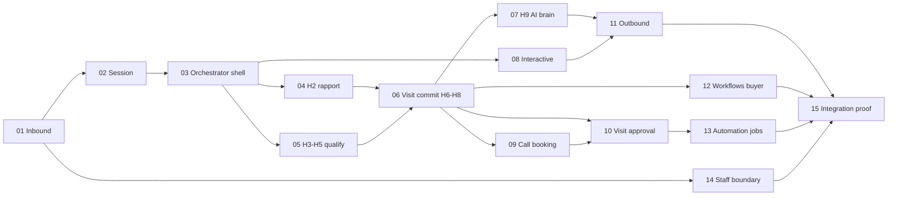

# Investo — AI Logic Refactor Chunks (full.md → Production Code)

| Field | Value |
|-------|-------|
| Purpose | Replace scattered / duplicate buyer AI logic with modules that behave **exactly** as [full.md](../full.md) specifies |
| Rule | **Each chunk edits ONLY the files listed in that chunk. Do not touch other files or lines.** |
| Order | Execute chunks **sequentially** (01 → 15). Later chunks depend on earlier contracts. |
| Verify after each chunk | Run the chunk’s unit tests + listed E2E scenarios before starting the next chunk |

---

## Why chunks?

The buyer pipeline today works but logic is spread across `whatsapp.service.ts` (~2.6k lines), `whatsappTurnOrchestrator.service.ts`, interactive handlers, visit/call booking, workflows, and H9 LLM paths. Refactoring in one PR breaks production. These chunks:

1. **Isolate** one vertical slice of [full.md](../full.md) per PR
2. **Remove** duplicate or conflicting AI paths inside that slice only
3. **Preserve** strict handler order and Zero-UI contracts from full.md
4. **Add** debug hooks (`logOutboundBranch`, action codes) so future regressions are traceable

---

## Dependency graph



---

## Chunk index

| Chunk | File | full.md PART | Primary files (IN SCOPE only) |
|-------|------|--------------|----------------------------|
| **01** | [chunk-01.md](./chunk-01.md) | I | `whatsapp.service.ts` (inbound guards block only), `inboundMessageGuard.service.ts`, `customerInboundQueue.service.ts` |
| **02** | [chunk-02.md](./chunk-02.md) | II | `buyerQualification.service.ts`, `buyer/buyerStartFresh.service.ts`, `buyer/buyerSession.util.ts` (new) |
| **03** | [chunk-03.md](./chunk-03.md) | III (shell, H-start, H1, H0, H1b) | `whatsappTurnOrchestrator.service.ts` (orchestrate + handlers H-start–H1b only) |
| **04** | [chunk-04.md](./chunk-04.md) | III (H2, H2b, H2.5) | `whatsappTurnOrchestrator.service.ts` (H2 block only), `buyerQualification.service.ts` (read-only) |
| **05** | [chunk-05.md](./chunk-05.md) | III (H3, H4, H5) | `whatsappTurnOrchestrator.service.ts` (H3–H5), `buyerVisitQuery.service.ts`, `buyer-memory-extract.service.ts` |
| **06** | [chunk-06.md](./chunk-06.md) | III (H6–H8) + V | `customerVisitBooking.service.ts`, `whatsappTurnOrchestrator.service.ts` (H6–H8 block) |
| **07** | [chunk-07.md](./chunk-07.md) | III (H9) + VIII + XI | `whatsappTurnOrchestrator.service.ts` (H9 only), `conversationStateMachine.ts`, `ai.service.ts` (buyer path hooks only) |
| **08** | [chunk-08.md](./chunk-08.md) | IV + XV | `whatsappInteractiveOrchestrator.service.ts`, `whatsappInteractivePersist.service.ts` |
| **09** | [chunk-09.md](./chunk-09.md) | VI | `customerCallBooking.service.ts`, `callRequest.service.ts`, `conversationCallContext.util.ts` |
| **10** | [chunk-10.md](./chunk-10.md) | V + X (visit jobs) | `visitPendingApproval.service.ts`, `visitBooking.service.ts`, `visitLifecycle.service.ts`, `bookingApproval.service.ts` |
| **11** | [chunk-11.md](./chunk-11.md) | XII | `whatsapp.service.ts` (outbound dispatch block only), `messagePolish.service.ts`, `whatsappResponseSanitizer.service.ts`, `outboundTurnDebug.service.ts` |
| **12** | [chunk-12.md](./chunk-12.md) | IX | `workflow/workflow-engine.service.ts` (buyer channel), `workflow-registry.ts`, buyer workflow actions |
| **13** | [chunk-13.md](./chunk-13.md) | X | `automation.service.ts`, `automationQueue.service.ts` |
| **14** | [chunk-14.md](./chunk-14.md) | XIII | `inboundWhatsAppRouting.service.ts`, `agent-router.service.ts` (staff intercept only) |
| **15** | [chunk-15.md](./chunk-15.md) | XVI–XVIII | `backend/scripts/e2e-handset-proof.mjs`, `backend/src/tests/unit/*` (listed per chunk rollup) |

---

## Global invariants (never violate across chunks)

From [full.md](../full.md) PART III.O and PART XII:

1. **Handler cascade order:** `H-start → H1 → H0 → visitCommit → H1b → H2 → H2b → H2.5 → callCommit → H-call → H3 → H4 → H5 → H6 → H7 → H7b → H8 → H9`
2. **One primary outbound per inbound** (`claimPrimaryOutboundSend`)
3. **Interactive taps bypass concurrent lock** but still dedupe by `messageId`
4. **Escalation ≠ takeover:** escalation keeps `ai_active`; takeover requires `agent_active && !aiEnabled`
5. **Visit booking default:** `pending_approval` unless `autoConfirmVisits=true`
6. **Pending message integrity:** create `pending` → update `sent|failed` after Meta API result

---

## After all chunks

Run full proof:

```bash
cd backend
npm test -- --testPathPattern="whatsapp|interactive|visit|call|workflow|leadTransition"
npx tsx scripts/e2e-handset-proof.mjs
```

Target: **28/28 E2E**, zero handler-order regressions, `logOutboundBranch` trace matches full.md for sample flows in PART XVIII.

---

**Start here:** [chunk-01.md](./chunk-01.md) ✅ → [chunk-02.md](./chunk-02.md) ✅ → [chunk-03.md](./chunk-03.md) ✅ → Next: [chunk-04.md](./chunk-04.md)
