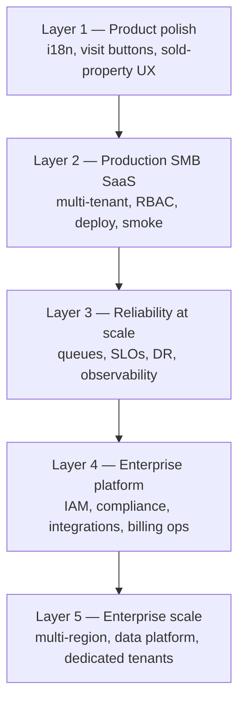

# Investo — Enterprise Platform Framework


| Field                 | Value                                                                                                                                                   |
| --------------------- | ------------------------------------------------------------------------------------------------------------------------------------------------------- |
| Document              | Enterprise maturity model, gap analysis, and master roadmap                                                                                             |
| Audience              | Engineering leads, platform, security, product, ops                                                                                                     |
| Last updated          | 2026-06-17                                                                                                                                              |
| Implementation chunks | `[chunks/README.md](./chunks/README.md)` (15 chunks)                                                                                                    |
| Related               | [01_PRD.md](./01_PRD.md), [02_TRD.md](./02_TRD.md), [06_IMPLEMENTATION_PLAN.md](./06_IMPLEMENTATION_PLAN.md), [docs/NECESSARY.md](../docs/NECESSARY.md) |


---

## 1. Purpose of this document

Investo uses the word **“enterprise”** in two different ways today:


| Term                    | Meaning                                                                                                      | Example in repo                                                                   |
| ----------------------- | ------------------------------------------------------------------------------------------------------------ | --------------------------------------------------------------------------------- |
| **Enterprise UX**       | Hardened buyer/staff flows for real agencies                                                                 | `buyerEnterpriseUx.service.ts`, `.cursor/rules/whatsapp-enterprise-readiness.mdc` |
| **Enterprise platform** | Infrastructure, compliance, scale, and operations for **many tenants × thousands of users** without breakage | This document                                                                     |


This document defines **true enterprise platform maturity** — what it is, what Investo has today, what is missing, and how to achieve it via **15 implementation chunks**.

**Product constraint (unchanged):** Investo remains a **WhatsApp-first operating system for Indian real-estate agencies** (2–30 staff primary). Enterprise platform work **enables scale and trust**; it does **not** mean becoming Salesforce, ERP, or unlimited custom CRM.

---

## 2. Five-layer maturity model




| Layer                       | Investo today (2026-06)                                  | Target                                               |
| --------------------------- | -------------------------------------------------------- | ---------------------------------------------------- |
| **L1 Product polish**       | ~85% — Enterprise v2 buyer UX largely shipped            | Maintain via evals + handset proof                   |
| **L2 Production SMB SaaS**  | ~75% — core CRM + WhatsApp + dashboard live              | Close P0 gaps in `PRODUCTION_READINESS_CHECKLIST.md` |
| **L3 Reliability at scale** | ~35% — partial Redis, worker, dedup; many P1 items open  | Chunks 02, 03, 07, 08                                |
| **L4 Enterprise platform**  | ~15% — audit logs, basic billing; no SSO/SOC2/public API | Chunks 04–06, 10–14                                  |
| **L5 Enterprise scale**     | ~5% — single-region, shared DB, no warehouse             | Chunks 09, 15                                        |


**Honest positioning:** Investo is **past MVP**, **strong for SMB agencies**, **not a fully enterprise platform**.

---

## 3. Twelve enterprise domains (master checklist)

Each domain maps to one or more implementation chunks. Status: ✅ have · ⚠️ partial · ❌ missing · ➖ not needed for SMB north star.

### 3.1 Identity, access, and org structure


| Capability                                   | Status | Chunk |
| -------------------------------------------- | ------ | ----- |
| JWT + refresh + HttpOnly cookies             | ✅      | —     |
| RBAC + custom roles (`CompanyRole`)          | ✅      | —     |
| MFA (TOTP/WebAuthn)                          | ❌      | 04    |
| SSO (SAML/OIDC)                              | ❌      | 04    |
| SCIM provisioning                            | ❌      | 04    |
| Org hierarchy (regions/branches)             | ❌      | 04    |
| Session policy (idle timeout, device limits) | ⚠️     | 04    |
| Break-glass emergency access                 | ❌      | 04    |


**Key files today:** `middleware/auth.ts`, `middleware/rbac.ts`, `services/auth.service.ts`, `routes/auth.routes.ts`, `frontend/src/context/AuthContext.tsx`

---

### 3.2 Compliance, legal, and trust


| Capability                                    | Status             | Chunk |
| --------------------------------------------- | ------------------ | ----- |
| Per-tenant data isolation (`company_id`)      | ✅                  | 03    |
| Audit logs (`AuditLog`)                       | ✅                  | 06    |
| GDPR/DPDP data subject requests               | ❌                  | 06    |
| Data retention policies per tenant            | ❌                  | 06    |
| Certified tenant export (leads, chats, files) | ⚠️ csv_export only | 06    |
| Legal hold / e-discovery                      | ❌                  | 06    |
| DPA / SLA templates                           | ❌                  | 06    |
| SOC 2 Type II program                         | ❌                  | 06    |
| Data residency (India region pin)             | ⚠️                 | 08    |


**Key files today:** `middleware/audit.ts`, `routes/audit.routes.ts`, `pages/audit-logs/AuditLogsPage.tsx`, `pages/legal/PrivacyPolicyPage.tsx`

---

### 3.3 Security depth


| Capability                       | Status | Chunk   |
| -------------------------------- | ------ | ------- |
| Webhook signature + IP whitelist | ✅      | —       |
| Input sanitization               | ✅      | —       |
| Rate limiting (Redis)            | ⚠️     | 03      |
| Secrets rotation / vault         | ❌      | 05      |
| WAF + DDoS                       | ❌      | 05      |
| Field-level PII encryption       | ❌      | 05      |
| BYOK (customer encryption keys)  | ❌      | 05 (L5) |
| Annual pen test + remediation    | ❌      | 05      |
| SIEM integration                 | ❌      | 07      |
| Support impersonation with audit | ❌      | 12      |


**Key files today:** `middleware/whatsappSecurity.ts`, `middleware/rateLimiter.ts`, `middleware/sanitizeInput.ts`, `utils/circuit-breaker.ts`

---

### 3.4 Reliability engineering (SRE)


| Capability                           | Status          | Chunk  |
| ------------------------------------ | --------------- | ------ |
| Health / readiness endpoints         | ✅               | —      |
| Prometheus metrics                   | ⚠️              | 07     |
| Sentry error tracking                | ✅               | —      |
| Async webhook processing (queue)     | ⚠️ sync-heavy   | 02     |
| DLQ for failed jobs                  | ❌               | 02     |
| Outbound retry + exponential backoff | ⚠️              | 02     |
| Circuit breaker (Meta API)           | ⚠️ util exists  | 02     |
| SLOs + error budgets                 | ❌               | 07     |
| Public status page                   | ❌               | 07     |
| Incident runbooks + postmortems      | ⚠️ partial docs | 07, 15 |
| Blue/green or canary deploy          | ❌               | 15     |
| Chaos / load testing at 10×          | ❌               | 15     |


**Key files today:** `routes/health.routes.ts`, `routes/readiness.routes.ts`, `routes/metrics.routes.ts`, `worker.ts`, `services/automationQueue.service.ts`, `services/propertyImportQueue.service.ts`

---

### 3.5 Multi-tenancy at scale


| Capability                                  | Status | Chunk |
| ------------------------------------------- | ------ | ----- |
| Shared DB + `company_id` isolation          | ✅      | —     |
| Tenant middleware enforcement               | ✅      | —     |
| Per-company WhatsApp creds in settings      | ✅      | —     |
| Per-tenant feature flags (`CompanyFeature`) | ✅      | —     |
| Per-tenant outbound quotas                  | ❌      | 03    |
| Noisy-neighbor isolation (CPU/conn limits)  | ❌      | 03    |
| Dedicated tenant tier (single-tenant DB)    | ❌      | 03    |
| Custom domain / white-label                 | ❌      | 13    |
| Tenant migration tooling                    | ❌      | 03    |


**Key files today:** `middleware/tenant.ts`, `middleware/featureGate.ts`, `middleware/subscriptionEnforcement.ts`, `utils/companyWhatsAppConfig.util.ts`

---

### 3.6 Data platform (OLTP vs analytics)


| Capability                          | Status             | Chunk |
| ----------------------------------- | ------------------ | ----- |
| Transactional PostgreSQL (Prisma)   | ✅                  | —     |
| pgvector RAG (property knowledge)   | ✅                  | —     |
| Event streaming (Kafka/EventBridge) | ❌                  | 09    |
| Analytics warehouse                 | ❌                  | 09    |
| CDC to warehouse                    | ❌                  | 09    |
| OpenSearch / Elasticsearch          | ❌                  | 09    |
| BI with row-level tenant security   | ⚠️ basic analytics | 09    |


**Key files today:** `services/propertyKnowledge.service.ts`, `routes/analytics.routes.ts`, `pages/analytics/AnalyticsPage.tsx`

---

### 3.7 Integration ecosystem


| Capability                            | Status  | Chunk |
| ------------------------------------- | ------- | ----- |
| Internal REST API (dashboard)         | ✅       | —     |
| Versioned public API                  | ❌       | 10    |
| Signed outbound webhooks              | ❌       | 10    |
| OAuth third-party apps                | ❌       | 10    |
| Pre-built connectors (Zoho, Calendar) | ❌       | 10    |
| Partner marketplace                   | ➖ defer | 10    |


**Key files today:** `routes/*.routes.ts`, no `routes/public-api/` namespace yet

---

### 3.8 Billing and commercial operations


| Capability                           | Status | Chunk |
| ------------------------------------ | ------ | ----- |
| Subscription plans                   | ✅      | —     |
| Invoices                             | ✅      | —     |
| Usage metering (messages, AI tokens) | ❌      | 11    |
| GST invoicing                        | ⚠️     | 11    |
| Entitlements sync (plan → features)  | ⚠️     | 11    |
| Dunning / suspend on non-payment     | ⚠️     | 11    |
| Enterprise MSAs / custom quotes      | ❌      | 11    |


**Key files today:** `routes/subscription.routes.ts`, `routes/invoice.routes.ts`, `pages/billing/BillingPage.tsx`

---

### 3.9 Support, success, and operability


| Capability                          | Status | Chunk |
| ----------------------------------- | ------ | ----- |
| Super-admin company list            | ✅      | —     |
| Tenant health dashboard (internal)  | ❌      | 12    |
| Support “view as tenant” with audit | ❌      | 12    |
| Tiered support SLAs                 | ❌      | 12    |
| In-app help / knowledge base        | ⚠️     | 12    |
| CSM playbook                        | ❌      | 12    |


**Key files today:** `routes/admin.routes.ts`, `pages/companies/CompaniesPage.tsx`, `services/readiness.service.ts`

---

### 3.10 Product configurability


| Capability                              | Status              | Chunk |
| --------------------------------------- | ------------------- | ----- |
| Fixed vertical schema + JSON extensions | ✅ by design         | —     |
| Per-tenant AI/WhatsApp settings         | ✅                   | —     |
| Custom fields unlimited                 | ➖ never             | —     |
| Visual workflow builder                 | ❌                   | 13    |
| Approval chains                         | ⚠️ booking approval | 13    |
| Sandbox tenant                          | ❌                   | 13    |
| Custom report builder                   | ❌                   | 13    |


**Key files today:** `services/workflow/workflow-engine.service.ts`, `pages/ai-settings/AISettingsPage.tsx`

---

### 3.11 AI and WhatsApp enterprise governance


| Capability                           | Status | Chunk |
| ------------------------------------ | ------ | ----- |
| Buyer LLM temp 0 + safe params       | ✅      | —     |
| Feature flags + shadow mode          | ✅      | —     |
| Prompt versioning + rollback         | ❌      | 14    |
| Per-tenant AI budget caps            | ❌      | 14    |
| Human review queue for risky replies | ❌      | 14    |
| Multi-WABA per company               | ⚠️     | 14    |
| Immutable message archive            | ❌      | 14    |
| Eval pipeline on every deploy        | ⚠️     | 14    |
| Template approval workflow (Meta)    | ⚠️     | 14    |


**Key files today:** `services/ai.service.ts`, `services/whatsapp/`*, `services/buyer/*`, `tests/evals/investo-evals.test.ts`

---

### 3.12 Engineering organization and process


| Capability                           | Status  | Chunk |
| ------------------------------------ | ------- | ----- |
| Smoke + unit + eval gates            | ✅       | 15    |
| Staging environment parity           | ⚠️      | 15    |
| Release train / change management    | ❌       | 15    |
| ADRs (architecture decision records) | ⚠️      | 15    |
| Load test in CI                      | ❌       | 15    |
| Partner certification program        | ➖ defer | 15    |


**Key files today:** `enter_main.md`, `npm run smoke`, `.github/`, `render.yaml`

---

## 4. Current vs target architecture

### 4.1 Today (Layer 2–3)

```
Buyer WhatsApp ──► Meta Cloud API ──► webhook.routes (Express)
                                           │
                    ┌──────────────────────┼──────────────────────┐
                    ▼                      ▼                      ▼
              whatsappTurnOrchestrator   ai.service          workflow-engine
                    │                      │                      │
                    ▼                      ▼                      ▼
              PostgreSQL (Supabase)   pgvector RAG          Redis (Upstash)
                    │                                            │
                    ▼                                            ▼
              React dashboard (Vercel)                    queues (partial)
```

**Stack:** Express + React + Prisma + PostgreSQL + Redis + S3/Supabase + Railway/Render

**Scale targets (PRD NFR):** 100+ companies, 10,000 concurrent conversations — **not yet proven at load**.

### 4.2 Target (Layer 4–5)

```
                        ┌─── WAF / CDN ───┐
                        ▼                 │
Buyer/Staff ──► Meta / Browser ──► API Gateway (rate limit, auth, tenant)
                                        │
                    ┌───────────────────┼───────────────────┐
                    ▼                   ▼                   ▼
              Webhook ingress      REST + Public API    WebSocket
              (fast ACK <200ms)         │                   │
                    │                   ▼                   │
                    ▼            Service layer              │
              Message queue ◄───────────────────────────────┘
              (Redis/SQS/BullMQ)         │
                    │                    ▼
                    ▼              PostgreSQL (OLTP)
              Worker pool                │
                    │                    ├── Event bus ──► Warehouse
                    ▼                    ├── OpenSearch
              Outbound queue             └── Immutable audit store
              + DLQ + circuit breaker
```

**Evolution principle:** Extend current stack incrementally — **no big-bang rewrite**. Add queue layer, public API namespace, IAM service, and data pipeline as bounded modules.

---

## 5. Implementation chunk map


| Chunk                      | Title                                                       | Layer | Priority | Est. duration |
| -------------------------- | ----------------------------------------------------------- | ----- | -------- | ------------- |
| [01](./chunks/chunk-01.md) | Baseline assessment & platform foundations                  | L2→L3 | P0       | 2 weeks       |
| [02](./chunks/chunk-02.md) | Async messaging pipeline (webhook → queue → worker)         | L3    | P0       | 3 weeks       |
| [03](./chunks/chunk-03.md) | Fair multi-tenancy (quotas, isolation, enforcement)         | L3    | P0       | 3 weeks       |
| [04](./chunks/chunk-04.md) | Enterprise IAM (MFA, SSO, SCIM, org hierarchy)              | L4    | P1       | 6 weeks       |
| [05](./chunks/chunk-05.md) | Security hardening (vault, WAF, encryption, pen test)       | L4    | P1       | 4 weeks       |
| [06](./chunks/chunk-06.md) | Compliance & data governance (DPDP, export, retention)      | L4    | P1       | 4 weeks       |
| [07](./chunks/chunk-07.md) | Observability, SLOs, status page, incident response         | L3    | P0       | 3 weeks       |
| [08](./chunks/chunk-08.md) | Disaster recovery & multi-region readiness                  | L3→L5 | P1       | 4 weeks       |
| [09](./chunks/chunk-09.md) | Data platform (events, warehouse, search)                   | L5    | P2       | 6 weeks       |
| [10](./chunks/chunk-10.md) | Public API, webhooks, integration ecosystem                 | L4    | P2       | 5 weeks       |
| [11](./chunks/chunk-11.md) | Usage metering, billing ops, entitlements                   | L4    | P2       | 4 weeks       |
| [12](./chunks/chunk-12.md) | Support tooling & tenant health                             | L4    | P2       | 3 weeks       |
| [13](./chunks/chunk-13.md) | Enterprise product config (sandbox, approvals, white-label) | L4    | P3       | 5 weeks       |
| [14](./chunks/chunk-14.md) | AI & WhatsApp governance at scale                           | L3→L4 | P1       | 4 weeks       |
| [15](./chunks/chunk-15.md) | Release engineering, load/chaos, org process                | L3→L5 | P1       | ongoing       |


**Execution rule:** Complete chunk N’s definition-of-done before starting N+1 within the same priority tier. P0 chunks (01–03, 07) unblock real multi-agency production load.

---

## 6. Global invariants (must never break)

These apply to **every** enterprise chunk:

1. **Tenant isolation** — every query filters `company_id`; cross-tenant access is forbidden except super-admin aggregates with audit.
2. **One-reply-per-turn** — buyer WhatsApp contract unchanged (`whatsappTurnOrchestrator`).
3. **Enterprise v2 buyer UX** — visit buttons, i18n, sold-property rules (`buyerEnterpriseUx.service.ts`).
4. **Feature flag kill switches** — new enterprise behavior behind env flags until staging sign-off.
5. **Smoke gate** — `npm run smoke` passes before any production deploy.
6. **No ERP creep** — defer unlimited custom schema, MLS, payment ledger (see `docs/NECESSARY.md`).

---

## 7. Definition of enterprise-ready (exit criteria)

Investo may claim **“enterprise platform ready”** when **all** of the following are true:


| Gate              | Proof                                                                                                  |
| ----------------- | ------------------------------------------------------------------------------------------------------ |
| **Load**          | 100 tenants, 500 concurrent staff, 10K active buyer conversations — p95 API <500ms, webhook ACK <200ms |
| **Reliability**   | 99.9% monthly uptime; documented RTO <1h, RPO <15min; quarterly DR drill passed                        |
| **Isolation**     | Automated tenant isolation test suite green; pen test no critical findings                             |
| **IAM**           | SSO + MFA available for company_admin; SCIM for user lifecycle                                         |
| **Compliance**    | DPDP data export/delete API; retention policies enforced; SOC 2 Type I complete                        |
| **Observability** | Public status page; SLO dashboards; on-call runbook exercised                                          |
| **Integrations**  | Versioned public API v1 + signed webhooks documented                                                   |
| **AI governance** | Per-tenant AI budgets; prompt versioning; eval gate in CI                                              |
| **Support**       | Tenant health dashboard; audited support impersonation                                                 |


Until then, market as: **“Production multi-tenant SaaS for Indian real-estate agencies.”**

---

## 8. What we explicitly will NOT build

Aligned with product north star — **never** in enterprise roadmap:

- Full ERP / accounting / legal module
- Unlimited custom objects (Salesforce-style)
- MLS / national listing portal
- Native iOS/Android apps (responsive web only)
- Payment ledger / escrow
- Multi-region active-active day one (stretch goal in chunk 08)

---

## 9. Quick reference — repo anchor map


| Domain   | Backend anchor                                    | Frontend anchor                           |
| -------- | ------------------------------------------------- | ----------------------------------------- |
| Auth     | `services/auth.service.ts`, `middleware/auth.ts`  | `context/AuthContext.tsx`, `pages/auth/`* |
| Tenant   | `middleware/tenant.ts`, `Company` model           | `context/TenantContext.tsx`               |
| RBAC     | `middleware/rbac.ts`, `CompanyRole`               | `config/navigation.config.ts`             |
| Features | `middleware/featureGate.ts`, `feature.routes.ts`  | `context/CompanyFeaturesContext.tsx`      |
| WhatsApp | `routes/webhook.routes.ts`, `services/whatsapp/*` | `pages/ai-settings/*`                     |
| Buyer UX | `services/buyer/*`, `utils/buyerI18n.util.ts`     | — (buyer has no dashboard)                |
| Workflow | `services/workflow/workflow-engine.service.ts`    | —                                         |
| Billing  | `routes/subscription.routes.ts`                   | `pages/billing/BillingPage.tsx`           |
| Audit    | `middleware/audit.ts`, `AuditLog`                 | `pages/audit-logs/*`                      |
| Workers  | `worker.ts`, `*Queue.service.ts`                  | `property-import/*` (progress UI)         |
| Health   | `routes/health.routes.ts`, `readiness.service.ts` | `services/health.ts`                      |


---

## 10. Related documents


| Document                                                                  | Use when                                    |
| ------------------------------------------------------------------------- | ------------------------------------------- |
| [chunks/README.md](./chunks/README.md)                                    | Implementing a specific enterprise chunk    |
| [06_IMPLEMENTATION_PLAN.md](./06_IMPLEMENTATION_PLAN.md)                  | AI A+ and feature delivery (parallel track) |
| [enter_main.md](../enter_main.md)                                         | Per-PR proof checklist                      |
| [PRODUCTION_READINESS_CHECKLIST.md](../PRODUCTION_READINESS_CHECKLIST.md) | P0/P1 launch blockers                       |
| [docs/NECESSARY.md](../docs/NECESSARY.md)                                 | Product scope guardrails                    |
| [docs/DISASTER_RECOVERY.md](../docs/DISASTER_RECOVERY.md)                 | DR baseline (to extend in chunk 08)         |
| [docs/SECURITY.md](../docs/SECURITY.md)                                   | Security baseline (to extend in chunk 05)   |


---

**Next step:** Start with [chunk-01](./chunks/chunk-01.md) (baseline + foundations), then P0 chunks 02, 03, 07 in order.