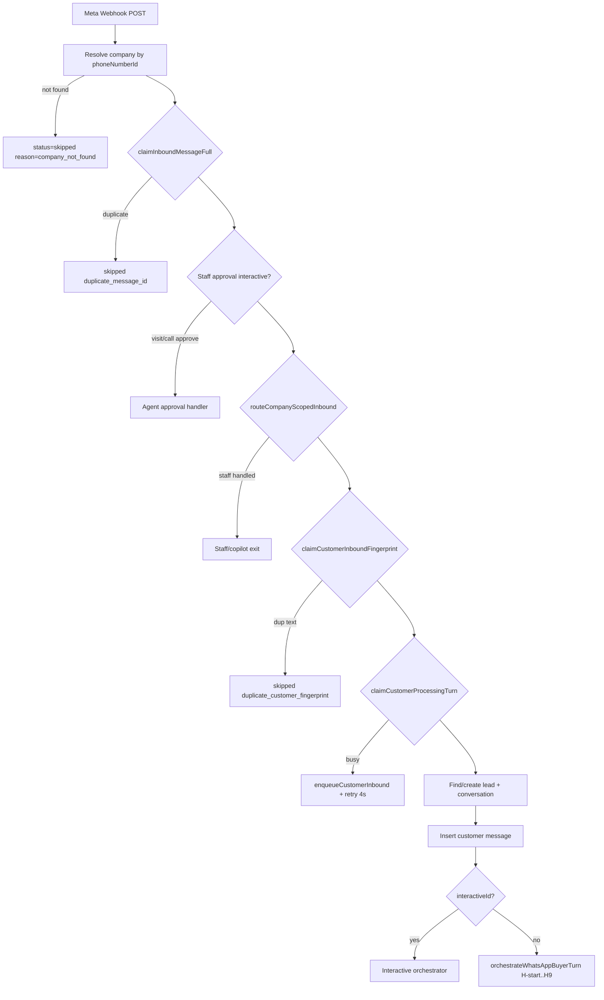
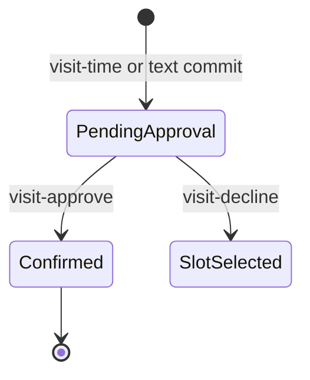

# Investo — Complete User Flow Hierarchy (EXTREME EDITION)

| Field | Value |
|-------|-------|
| Document | Exhaustive buyer WhatsApp real-estate flow hierarchy |
| Audience | Engineering, QA, product, sales ops |
| Source of truth | `whatsapp.service.ts`, `whatsappTurnOrchestrator.service.ts`, `whatsappInteractiveOrchestrator.service.ts`, `conversationStateMachine.ts`, visit/call booking services |
| Last updated | 2026-06-08 |

---

## Table of Contents

1. PART I: Inbound Pipeline — Every Guard Step
2. PART II: Session Taxonomy — 1st / 2nd / nth Conversation
3. PART III: Handler Reference — H-start through H9
4. PART IV: Interactive Orchestrator — Every interactiveId
5. PART V: Visit Booking Mega-Tree
6. PART VI: Call Booking Mega-Tree
7. PART VII: Three FSMs — All Transitions
8. PART VIII: Nine Objection Playbooks — Full Copy
9. PART IX: Buyer Workflows — workflow-registry Steps
10. PART X: Automation Job Catalog
11. PART XI: Conversation Stage Config — All 10 Stages
12. PART XII: Outbound Pipeline
13. PART XIII: Staff WhatsApp Copilot Tree (5 Layers)
14. PART XIV: Configuration Matrix
15. PART XV: Interactive ID Master Table (30+ rows)
16. PART XVI: E2E Scenario Mapping
17. PART XVII: Failure / Error Matrix (40+ rows)
18. PART XVIII: Happy Path + 5 Alternate Paths
19. PART XIX: Mermaid Diagrams
20. PART XX: Appendix — Redis Keys & Action Codes

---

## Legend

### C / A / D / S Notation

| Tag | Meaning |
|-----|---------|
| **C** | Client — buyer-visible WhatsApp message or button |
| **A** | Agent — Investo user notification, WhatsApp to agent, or dashboard action |
| **D** | Dashboard — DB writes, socket events, CRM state |
| **S** | System — internal guards, queues, automation, no direct user message |

Inline tags appear as `[C]`, `[A]`, `[D]`, `[S]` at branch leaves.

### Handler IDs (Turn Orchestrator Cascade)

| ID | File anchor | Role |
|----|-------------|------|
| `H-start` | `handleStartFreshTurn` | `/start` full reset |
| `H1` | `handleHumanTakeoverTurn` | Agent takeover handoff |
| `H0` | `handleInteractiveSafetyTurn` | Interactive safety net (missed upstream) |
| `H1b` | `handleDismissalTurn` | Polite dismissal ack |
| `H2` | `handleRapportTurn` | Greeting fast-path |
| `H2b` | `handleReturningBuyerPivotTurn` | "Something new" pivot |
| `H2.5` | `handlePropertyBrowsingTurn` | Deterministic inventory list |
| `H-call` | `handleCallCommitReplyTurn` | Text call booking commit |
| `H3` | `handleMemoryRecallTurn` | Preference recall |
| `H4` | `handleQualificationTurn` | Budget/area ack |
| `H5` | `handleVisitStatusTurn` | Visit status query |
| `H6` | `handleVisitCommitWorkflowTurn` | Workflow suggestion from visit commit |
| `H7` | `handleClassifierWorkflowTurn` | LLM workflow classifier |
| `H7b` | inline in `orchestrateWhatsAppBuyerTurn` | Bare visit intent → ask time |
| `H8` | `handleVisitCommitReplyTurn` | Visit text commit reply |
| `H9` | `handleFullAiTurn` | Full LLM brain |

### Action Codes (agent-action-log / debug)

| Code | Trigger |
|------|---------|
| `autoCreateLeadFromWhatsApp` | New lead upsert |
| `interactiveActionHandled` | Interactive tap handled |
| `visitApprovalInteractive` | Agent tap visit-approve/decline |
| `callApprovalInteractive` | Agent tap call-approve/decline |
| `customerVisitBooked` | H8 visit committed scheduled |
| `visit_pending_approval` | Pending approval path |
| `workflow_cancel_visit` / `workflow_reschedule_visit` | Visit mutation |
| `workflow_escalate_to_human` | H9 escalation notify-only |
| `buyer_start_fresh_reset` | H-start reset |
| `wrongReportHandled` | Wrong-number report |
| `visit_confirmed_by_agent` | Agent approved pending visit |

---

## PART I: Inbound Pipeline — Every Guard Step



### I.1 Company Resolution
### I.1 Company lookup

```
Branch                                      C   A   D   S
─────────────────────────────────────────────────────────
getCompanyByPhoneNumberId(phoneNumberId)                 -   -   -   S
├─ exact match settings.whatsapp.meta.phoneNumberId      -   -   -   S
├─ duplicate matches → display phone / lead phone / token -   -   -   S
├─ global WHATSAPP_PHONE_NUMBER_ID fallback              -   -   -   S
└─ non-prod single-company fallback                      -   -   -   S
NOT FOUND → return skipped company_not_found             -   -   -   S
```

### I.2 Layer 1 — Full Inbound Message Dedup (Redis + DB)
| Step | Redis Key | TTL | Skip reason |
|------|-----------|-----|-------------|
| `claimInboundMessageFull` | `inbound:{companyId}:{messageId}` | dedup service default | `duplicate_message_id` |
| DB insert | `inbound_whatsapp_dedup` unique `(companyId, whatsappMessageId)` | permanent until release | P2002 → skip |
- Skipped when `queuedReplay=true` (FIFO drain replay).
- `releaseInboundMessageFull` on catastrophic failure → allows Meta retry.

### I.3 Layer 2 — Staff Approval Intercept (before prospect flow)
### Staff interactive intercept

```
Branch                                      C   A   D   S
─────────────────────────────────────────────────────────
interactiveId starts visit-approve-|visit-decline-       -   A   -   S
interactiveId starts call-approve-|call-decline-         -   A   -   S
├─ findCompanyUserByPhone(sender)                        -   -   -   S
├─ tryHandleVisitApprovalInteractive / Call              -   A   D   S
└─ return processed visit_approval_handled               -   -   -   S
```

### I.4 Layer 3 — Staff Route (never prospect AI)
### routeCompanyScopedInbound

```
Branch                                      C   A   D   S
─────────────────────────────────────────────────────────
Phone matches active company user (last-10)            -   -   -   S
├─ AGENT_COPILOT_ROLES → agent-router copilot           C   A   D   S
├─ tryHandleAgentVisitApprovalReply (text yes/no)        -   A   D   S
├─ tryHandleAgentCallApprovalReply                       -   A   D   S
└─ other staff → staffNonCopilotMessage                  C   -   -   S
Stranger phone → handled=false → prospect pipeline       -   -   -   S
```

### I.5 Layer 4 — Customer Text Fingerprint Dedup
| Condition | Redis Key Pattern | TTL | Skip |
|-----------|-------------------|-----|------|
| Plain text only (no interactiveId) | `customer-fp:{companyId}:{last10}:{sha16}` | 90s | `duplicate_customer_fingerprint` |
| Interactive taps | SKIPPED (button titles repeat) | — | — |

### I.6 Layer 5 — Concurrent Processing Lock + Queue
| Mechanism | Key | TTL | Behavior |
|-----------|-----|-----|----------|
| `claimCustomerProcessingTurn` | `customer-processing:{companyId}:{last10}` | **60s** | One AI turn per phone |
| Interactive tap | **Bypass lock** (always claimed) | — | Buttons never queue |
| On lock fail | `enqueueCustomerInbound` → Redis list `customer-inbound-queue:{companyId}:{last10}` | 3600s | FIFO |
| Queue fail backup | `retry_concurrent_inbound` job | **+4s** | `whatsapp.service.ts` |
| Drain | `drainCustomerInboundQueue` in `finally` | — | `queuedReplay=true` |
| Drain fail retry | `retry_concurrent_inbound` | **+5s** | `customerInboundQueue.service.ts` |

### I.7 Lead Upsert + Phone Last-10 Match
### Lead resolution

```
Branch                                      C   A   D   S
─────────────────────────────────────────────────────────
findFirst companyId + exact phone                        -   -   D   S
├─ miss → endsWith last10 digits orderBy updatedAt desc -   -   D   S
│   └─ phone normalize update if format differs          -   -   D   S
└─ still miss → upsert unique(companyId, phone)        -   A   D   S
    ├─ assignLeadWithRouting                             -   A   D   S
    ├─ notification lead_new (company)                   -   A   D   S
    ├─ notifyAgentOfNewLead                              -   A   D   S
    ├─ SOCKET_EVENTS.LEAD_CREATED                        -   -   D   S
    └─ logAgentAction autoCreateLeadFromWhatsApp         -   -   D   S
```

### I.8 Conversation Bootstrap
| Field | Initial value |
|-------|---------------|
| `status` | `ai_active` |
| `stage` | `rapport` |
| `commitments` | all false via `createInitialState()` |
| `urgencyScore` / `valueScore` | 5 |

### I.9 Message Persist Dedup Layers
### After lead/conversation ready

```
Branch                                      C   A   D   S
─────────────────────────────────────────────────────────
findFirst message by whatsappMessageId                   -   -   -   S
├─ exists → skip                                         -   -   -   S
prisma.message.create customer                           -   -   D   S
├─ P2002 unique whatsappMessageId → skip                 -   -   -   S
duplicate content window 90s same conversation           -   -   -   S
│   reason=duplicate_customer_content                    -   -   -   S
wrong report message → handleWrongReport + WRONG_ACK     C   -   D   S
```

### I.10 AI Reactivation + Interactive Routing
- `ensureProspectConversationAiActive` — re-enables AI unless manual `agent_active && !aiEnabled`.
- Legacy `human_escalated` stage → reset to `rapport`.
- Interactive path: `handleInteractiveAction` → `tryOrchestratedInteractiveAction`.

---

## PART II: Session Taxonomy — 1st vs 2nd vs nth Conversation
### II.1 hasPriorOutbound Definition
```typescript
history.some(m => m.senderType === "ai" || m.senderType === "agent")
```
- Computed from last **30** messages in conversation.
- Used by H2, H1b, H2b, H9 banned-phrase context, rapport returning detection.

### II.2 Session Classes
| Class | hasPriorOutbound | Typical inbound | Handler | Outbound shape |
|-------|------------------|-----------------|---------|----------------|
| **1st conversation** | `false` | `Hi` | H2 | Full welcome + filter buttons |
| **2nd+ greeting** | `true` | `Hi` | H2 returning | Short welcome-back, **no buttons** |
| **Returning pivot** | `true` | `Something new` | H2b | Fresh search prompt, stage→qualify |
| **Continued thread** | `true` | qualification / visit | H4-H9 | Context-aware |
| **Fresh restart** | any | `/start` | H-start | Clears visits/calls/approvals, stage→rapport |

### II.3 isReturningBuyerGreeting
```
hasPriorOutbound === true
AND /^(hi|hello|hey|good\s+(morning|afternoon|evening))[\s,!]*$/i
```

### II.4 isBuyerRapportMessage nuance
### Rapport gate

```
Branch                                      C   A   D   S
─────────────────────────────────────────────────────────
EXPLICIT_INTENT regex → false (price, visit, book…)     -   -   -   S
isRapportPhrase → true                                   -   -   -   S
Bare greeting + hasPriorOutbound → H2 returning          C   -   -   S
Bare greeting + !hasPriorOutbound → H2 first welcome     C   -   -   S
Greeting + intent ("Hi 3BHK Whitefield") → not bare      -   -   -   S
  may fall H4 or H9                                      C   -   D   S
```

---

## PART III: Handler Reference — H-start through H9
### III.H-start
| Attribute | Value |
|-----------|-------|
| Preconditions | isBuyerStartCommand → "/start" |
| Skip | Not /start |
| Client template | buildBuyerStartFreshReply |
| Buttons | none |
| DB writes | visits/calls/approvals cancelled; conversation→rapport |
| Socket | conversation:updated |
| Agent | buyer_start_fresh_reset log |
| Action log | buyer_start_fresh_reset |
### H-start branches

```
Branch                                      C   A   D   S
─────────────────────────────────────────────────────────
resetBuyerBookingAndConversationState [D]
RETURN terminal replyPacing=none [C]
```

### III.H1
| Attribute | Value |
|-----------|-------|
| Preconditions | humanTakeover (agent_active && !aiEnabled) |
| Skip | AI active |
| Client template | Handoff + operatorContact |
| Buttons | none |
| DB writes | message ai (dedup handoff); notification |
| Socket | none |
| Agent | WhatsApp + in-app takeover |
| Action log | none |
### H1 branches

```
Branch                                      C   A   D   S
─────────────────────────────────────────────────────────
Dedup identical handoff spam [C]
Notify assigned or all admins [A]
```

### III.H0
| Attribute | Value |
|-----------|-------|
| Preconditions | interactiveId in orchestrator safety |
| Skip | No interactiveId |
| Client template | Interactive turnResult or fallback |
| Buttons | per handler |
| DB writes | persist + side effects |
| Socket | varies |
| Agent | varies |
| Action log | varies |
### H0 branches

```
Branch                                      C   A   D   S
─────────────────────────────────────────────────────────
tryOrchestratedInteractiveAction [C/D]
buildSafeBuyerFallback if unhandled [C]
```

### III.H1b
| Attribute | Value |
|-----------|-------|
| Preconditions | DISMISSAL_RE + hasPriorOutbound |
| Skip | visit commit; !hasPriorOutbound |
| Client template | DISMISSAL_ACKS random |
| Buttons | none |
| DB writes | message ai |
| Socket | none |
| Agent | none |
| Action log | none |
### H1b branches

```
Branch                                      C   A   D   S
─────────────────────────────────────────────────────────
no thanks / ok / thanks [C]
```

### III.H2
| Attribute | Value |
|-----------|-------|
| Preconditions | isBuyerRapportMessage; not mid-booking stage |
| Skip | visit commit; visit_booking|confirmation|commitment |
| Client template | buildBuyerRapportReply |
| Buttons | rapport filters if first-time |
| DB writes | message ai |
| Socket | none |
| Agent | none |
| Action log | none |
### H2 branches

```
Branch                                      C   A   D   S
─────────────────────────────────────────────────────────
First welcome + buttons [C]
Returning short ack no buttons [C]
```

### III.H2b
| Attribute | Value |
|-----------|-------|
| Preconditions | isReturningBuyerPivotReply |
| Skip | visit commit; !hasPriorOutbound |
| Client template | buildReturningBuyerPivotReply |
| Buttons | none |
| DB writes | stage→qualify clear props |
| Socket | none |
| Agent | none |
| Action log | none |
### H2b branches

```
Branch                                      C   A   D   S
─────────────────────────────────────────────────────────
something new / start fresh [C]
```

### III.H2.5
| Attribute | Value |
|-----------|-------|
| Preconditions | isPropertyBrowsingIntent |
| Skip | visit commit; visit/price guards |
| Client template | availability_check workflow |
| Buttons | resolveBuyerComponents |
| DB writes | message ai |
| Socket | none |
| Agent | none |
| Action log | none |
### H2.5 branches

```
Branch                                      C   A   D   S
─────────────────────────────────────────────────────────
property/properties/show me [C]
Never book/visit/price here [S]
```

### III.H-call
| Attribute | Value |
|-----------|-------|
| Preconditions | callCommit.committed |
| Skip | !committed; interactiveId on call |
| Client template | call status/book/cancel replies |
| Buttons | call mgmt if active |
| DB writes | call_requests |
| Socket | CALL_* |
| Agent | approval WhatsApp |
| Action log | callback |
### H-call branches

```
Branch                                      C   A   D   S
─────────────────────────────────────────────────────────
scheduleCallRequest pending [C/A/D]
awaitingCallTime path [C]
```

### III.H3
| Attribute | Value |
|-----------|-------|
| Preconditions | isBuyerMemoryRecallQuery |
| Skip | visit commit |
| Client template | buildBuyerMemoryRecallReply |
| Buttons | none |
| DB writes | memory patch async |
| Socket | none |
| Agent | none |
| Action log | none |
### H3 branches

```
Branch                                      C   A   D   S
─────────────────────────────────────────────────────────
what is my budget [C]
```

### III.H4
| Attribute | Value |
|-----------|-------|
| Preconditions | isBuyerQualificationStatement |
| Skip | EXPLICIT_INTENT; questions |
| Client template | buildBuyerQualificationAckReply |
| Buttons | none |
| DB writes | patchLeadMemory |
| Socket | none |
| Agent | none |
| Action log | none |
### H4 branches

```
Branch                                      C   A   D   S
─────────────────────────────────────────────────────────
budget/bhk/area statement [C]
```

### III.H5
| Attribute | Value |
|-----------|-------|
| Preconditions | isBuyerVisitStatusQuery |
| Skip | visit commit |
| Client template | buildBuyerVisitStatusReply |
| Buttons | visit overlay |
| DB writes | stage→confirmation |
| Socket | none |
| Agent | none |
| Action log | none |
### H5 branches

```
Branch                                      C   A   D   S
─────────────────────────────────────────────────────────
any visits booked [C]
```

### III.H6
| Attribute | Value |
|-----------|-------|
| Preconditions | visitCommit.workflowSuggestion |
| Skip | !suggestion || committed |
| Client template | runWorkflow suggested |
| Buttons | contextual |
| DB writes | selectedPropertyId |
| Socket | none |
| Agent | none |
| Action log | none |
### H6 branches

```
Branch                                      C   A   D   S
─────────────────────────────────────────────────────────
cancel_visit / reschedule_visit [C/D]
```

### III.H7
| Attribute | Value |
|-----------|-------|
| Preconditions | !committed; !interactive; !rich I want defer |
| Skip | committed; interactive |
| Client template | classifyAndRunBuyerWorkflow |
| Buttons | contextual |
| DB writes | property context |
| Socket | none |
| Agent | escalate wf |
| Action log | varies |
### H7 branches

```
Branch                                      C   A   D   S
─────────────────────────────────────────────────────────
LLM classifier [S]
resolveBuyerPropertyReference [D]
```

### III.H7b
| Attribute | Value |
|-----------|-------|
| Preconditions | isVisitActionRequest && !committed |
| Skip | time already parsed |
| Client template | Ask preferred date/time |
| Buttons | none |
| DB writes | stage visit_booking |
| Socket | none |
| Agent | none |
| Action log | none |
### H7b branches

```
Branch                                      C   A   D   S
─────────────────────────────────────────────────────────
book visit without datetime [C]
```

### III.H8
| Attribute | Value |
|-----------|-------|
| Preconditions | visitCommit.committed + customerReply |
| Skip | !committed |
| Client template | visit commit reply |
| Buttons | rare |
| DB writes | stage/commitments/lead status |
| Socket | visit events |
| Agent | visit_* log |
| Action log | customerVisitBooked etc |
### H8 branches

```
Branch                                      C   A   D   S
─────────────────────────────────────────────────────────
pending_approval [C/A/D]
scheduled/reschedule/cancel modes
```

### III.H9
| Attribute | Value |
|-----------|-------|
| Preconditions | fallback always runs |
| Skip | never |
| Client template | aiService + sanitize |
| Buttons | from newState |
| DB writes | full state persist |
| Socket | escalation assist |
| Agent | notifyBuyerAgentAssistNeeded |
| Action log | workflow_escalate_to_human |
### H9 branches

```
Branch                                      C   A   D   S
─────────────────────────────────────────────────────────
28s timeout fallback [C]
one interactive OR one media [S]
```

### III.O Cascade Order
`H-start → H1 → H0 → visitCommit → H1b → H2 → H2b → H2.5 → callCommit → H-call → H3 → H4 → H5 → H6 → H7 → H7b → H8 → H9`
---

## PART IV: Interactive Orchestrator — Every interactiveId

Entry: `whatsapp.service.handleInteractiveAction` → `tryOrchestratedInteractiveAction` → `routeInteractiveAction`.
Legacy in `whatsapp.service.ts`: `prop-*`, `location-*`, `emi-calculator`.
Persist: `persistInteractiveAiTranscript` (15s idempotent). Side effects: `applyInteractiveActionSideEffects`.

### IV.1 `visit-confirm` → handleVisitConfirm

### visit-confirm

```
Branch                                      C   A   D   S
─────────────────────────────────────────────────────────
FIND visit status IN scheduled|confirmed for leadId           -   -   D   S
├─ NONE → action visit-confirm-no-visit                       C   -   -   S
├─ confirmVisitById suppressCustomerNotification=true         -   -   D   S
├─ FAIL → visit-confirm-failed                                C   -   -   S
└─ OK → action visit-confirmed leadStatus visit_scheduled     C   -   D   S
```

### IV.2 `visit-reschedule` → handleVisitReschedule

### visit-reschedule

```
Branch                                      C   A   D   S
─────────────────────────────────────────────────────────
FIND active visit scheduled|confirmed                         -   -   D   S
├─ NONE → visit-reschedule-no-visit                           C   -   -   S
└─ OK → C: new time prompt + buildVisitSlotButtons            C   -   D   S
```

### IV.3 `visit-time-{propertyId}-{slot}` → handleVisitTimeSlot

### visit-time-{propertyId}-{slot}

```
Branch                                      C   A   D   S
─────────────────────────────────────────────────────────
parseVisitTimeInteractiveId → propertyId + slot               -   -   -   S
├─ PARSE FAIL → visit-time-parse-failed                       C   -   -   S
├─ property unavailable → visit-property-unavailable            C   -   -   S
├─ assignLeadRoundRobin if no agent                           -   A   D   S
├─ no agent → visit-no-agent                                  C   A   -   S
├─ confirmed visit exists → notifyAgentVisitChangeRequested     C   A   D   S
└─ createVisitApprovalRequest → visit-pending-agent-approval   C   A   D   S
    Slots: tomorrow-10am|3pm, dayafter → resolveVisitSlotToDate -   -   -   S
```

### IV.4 `book-visit | book-visit-{propertyId}` → handleBookVisit

### book-visit | book-visit-{propertyId}

```
Branch                                      C   A   D   S
─────────────────────────────────────────────────────────
propertyId from suffix OR selectedPropertyId                -   -   D   S
├─ no property → book-visit-no-property                       C   -   -   S
├─ invalid → book-visit-invalid-property                      C   -   -   S
├─ notify agent visit interest                                -   A   D   S
└─ slot buttons buildVisitSlotButtons stage visit_booking       C   -   D   S
```

### IV.5 `visit-slot-morning | visit-slot-afternoon` → handleGenericVisitSlot

### visit-slot-morning | visit-slot-afternoon

```
Branch                                      C   A   D   S
─────────────────────────────────────────────────────────
requires selectedPropertyId                                 -   -   D   S
├─ missing → generic-slot-no-property                         C   -   -   S
└─ reroute book-visit-{selectedPropertyId}                    C   -   D   S
```

### IV.6 `call-me | callback-request` → handleCallMe

### call-me | callback-request

```
Branch                                      C   A   D   S
─────────────────────────────────────────────────────────
scheduleCallRequest with resolveCallScheduledAt               -   -   D   S
├─ fail → setConversationAwaitingCallTime                     C   -   D   S
└─ ok → formatBuyerCallReply + call mgmt buttons              C   A   D   S
```

### IV.7 `call-cancel` → handleCallCancel

### call-cancel

```
Branch                                      C   A   D   S
─────────────────────────────────────────────────────────
findActiveCallRequest                                       -   -   D   S
├─ none → no callback message                                 C   -   -   S
├─ confirmed → notifyAgentCallChangeRequested                 C   A   D   S
└─ cancelCallRequest                                          C   A   D   S
```

### IV.8 `call-reschedule` → handleCallReschedule

### call-reschedule

```
Branch                                      C   A   D   S
─────────────────────────────────────────────────────────
setConversationAwaitingCallTime → prompt new time       C   -   D   S
```

### IV.9 `more-info | more-info-{propertyId}` → handleMoreInfo

### more-info | more-info-{propertyId}

```
Branch                                      C   A   D   S
─────────────────────────────────────────────────────────
property details + knowledge chunks                           C   -   D   S
├─ active visit overlay + visit mgmt buttons                  C   -   D   S
├─ no visit → book-visit location call-me                     C   -   -   S
└─ brochure media via resolveInteractiveBrochure              C   -   -   S
```

### IV.10 `filter-{type}` → handlePropertyFilter

### filter-{type}

```
Branch                                      C   A   D   S
─────────────────────────────────────────────────────────
30s dedup Filter applied:{displayName}                        -   -   D   S
├─ dup → filter-duplicate-prevented                           C   -   -   S
├─ 0 results → searchAlternativeTiers WAITLIST hint             C   -   D   S
└─ hits → list prop-{id} rows stage shortlist                 C   -   D   S
```

---

## PART V: Visit Booking Mega-Tree

### V.1 Text commit tryCommitCustomerVisitBooking

```
Branch                                      C   A   D   S
─────────────────────────────────────────────────────────
cancel/reschedule → workflowSuggestion OR tryCustomerVisitCancelReschedule
pending approval + slot → reschedulePendingVisitApprovalForBuyer
gate isVisitSchedulingMessage | isShortVisitConfirmation | isCustomVisitSlot
short confirm + already confirmed → skip rebook
refreshProposedVisitTime from DB
resolveScheduledAt + resolvePropertyId + fallback property
existing visit 5min dedupe OR reschedule approval
submitBuyerVisitApproval → createVisitApprovalRequest pending_approval
```

### V.2 Interactive commit
All `visit-time-*` → `createVisitApprovalRequest` (direct schedule disabled).

### V.3 Agent approve (`resolveVisitApproval`)
### Approve/decline

```
Branch                                      C   A   D   S
─────────────────────────────────────────────────────────
decline → customer pick new slot                              C   -   D   S
approve → scheduleVisit/reschedule + confirmVisitById         -   -   D   S
customer confirm text + stage confirmation + lead visit_scheduled C - D S
scheduleVisitReminderJobs 24h/1h                              -   -   D   S
```

### V.4 autoConfirmVisits — `isVisitAutoConfirmEnabled` from aiSetting then env.
### V.5 Idempotency — `buildVisitApprovalIdempotencyKey`, 5min dedupe window.

---

## PART VI: Call Booking Mega-Tree
### tryCommitCustomerCallBooking

```
Branch                                      C   A   D   S
─────────────────────────────────────────────────────────
isCallStatusQuery → buildBuyerCallStatusReply                 C   -   D   S
cancel/reschedule with confirmed → notify agent               C   A   D   S
scheduleCallRequest pending_approval + agent approve buttons  C   A   D   S
Redis call-sched idempotency 86400s                           -   -   -   S
```


---

## PART VII: Three FSMs — All Transitions

### VII.1 Conversation stages
`rapport → qualify → shortlist → commitment → visit_booking → confirmation → closed_won`
Side path: `objection_handling`. Terminal: `human_escalated`, `closed_lost`.
Protected: visit_booking|confirmation|commitment cannot regress to early funnel unless START_OVER_RE.

### VII.2 Lead statuses
`new → contacted → visit_scheduled → visited → negotiation → closed_won|closed_lost`

### VII.3 Visit statuses
`scheduled → confirmed → completed`; terminals `cancelled`, `no_show`; walk-in `scheduled → completed`.

---

## PART VIII: Nine Objection Playbooks — Full Copy
### price_too_high
| Empathy | I completely understand - budget is important and you want to make sure you're getting value for your investment. |
| Reframe | What many of our clients found is that the per-sqft price here is actually lower than comparable properties, plus the location premium will only increase. |
| Bridge | Would it help if I show you similar options in a slightly lower range, or break down the EMI to see monthly commitment? |
| Fallback | Let me check if there are any ongoing offers or payment plans that could help. |

### need_family_discussion
| Empathy | That's absolutely the right approach - such an important decision should involve everyone. |
| Reframe | Many families actually prefer to visit together, so everyone can see the property and ask questions directly. |
| Bridge | Would it help if I send you a detailed info pack to share with your family, and we schedule a visit where everyone can come? |
| Fallback | When do you think you'd be able to discuss? I can call back or set up a convenient time. |

### just_exploring
| Empathy | That's smart! Taking time to explore options is the best way to make a confident decision. |
| Reframe | Our site visits are actually designed for people in the research phase - no pressure, just information gathering. |
| Bridge | Since you're exploring, would a quick 20-minute visit help you understand the actual experience vs. just looking online? |
| Fallback | I can send you our comparison guide of properties in this area - it might help with your research. |

### send_details_only
| Empathy | Of course, I'll share all the details right away. |
| Reframe | Just so you know, photos don't capture the actual feeling of the space and the neighborhood vibe. |
| Bridge | I'll send the brochure now. Can I also schedule a quick visit for this weekend so you can experience it firsthand? |
| Fallback | Would a virtual tour video work as a first step? |

### bad_location
| Empathy | Location is definitely crucial - you want somewhere that fits your lifestyle. |
| Reframe | This area is actually developing rapidly. The new metro line opening next year will cut commute time significantly. |
| Bridge | Would you like to see properties closer to your preferred area, or would you be open to visiting this one to see the actual connectivity? |
| Fallback | Let me find options in your preferred area that match your other requirements. |

### bad_timing
| Empathy | I understand - timing has to be right for such a big decision. |
| Reframe | Interestingly, many of our clients started visiting 6-12 months before they planned to buy, just to understand the market. |
| Bridge | When are you thinking of making the move? I can keep you updated on new launches and offers closer to your timeline. |
| Fallback | Would it help if I add you to our early-access list for upcoming projects? |

### competitor_preference
| Empathy | It's good that you're comparing options - that's the best way to find the right fit. |
| Reframe | Each project has its strengths. We'd love for you to compare ours directly - many clients who visited both preferred our value proposition. |
| Bridge | Would you like to visit ours as well, so you can make a direct comparison? |
| Fallback | What specifically do you like about the other project? I might be able to match or better it. |

### trust_issue
| Empathy | Trust is absolutely essential when making such a significant investment. I appreciate your caution. |
| Reframe | We're RERA registered, and I can share references from existing homeowners if that would help. |
| Bridge | Would you like me to share our RERA number for verification, or connect you with a current resident? |
| Fallback | I can arrange a visit where you meet our project manager and see the construction quality firsthand. |

### unknown
| Empathy | I want to make sure I understand your concern correctly. |
| Reframe | Could you tell me more about what's holding you back? I want to help address it. |
| Bridge | What would need to be true for you to feel comfortable taking the next step? |
| Fallback | If there's anything specific I can help clarify, please let me know. |

---

---

## PART IX: Buyer Workflows — Step-by-Step
### IX.1 `new_lead`
1. `createLead`
2. `assignAgent?`
3. `sendWelcome?`
4. `notifyAgent?`

### IX.2 `update_status`
1. `resolveLead`
2. `updateLeadStatus`
3. `logLeadHistory`
4. `notifyIfCritical?`
5. `syncLeadMemory?`

### IX.3 `add_note`
1. `resolveLead`
2. `addLeadNote`
3. `syncLeadMemory`

### IX.4 `assign_agent`
1. `resolveLead`
2. `resolveAgent`
3. `reassignLead`
4. `notifyAgentChange`

### IX.5 `schedule_visit`
1. `resolveLead`
2. `bookVisit`
3. `updateLeadStatusVisitScheduled?`
4. `sendVisitConfirmation?`
5. `scheduleVisitReminders?`
6. `syncLeadMemory?`

### IX.6 `reschedule_visit`
1. `resolveVisit`
2. `cancelVisitSlot?`
3. `bookVisit`
4. `updateVisitStatus?`
5. `sendVisitConfirmation?`
6. `rescheduleReminders?`

### IX.7 `cancel_visit`
1. `resolveVisit`
2. `cancelVisit`
3. `notifyAgent?`
4. `scheduleFollowUp?`

### IX.8 `complete_visit`
1. `resolveVisit`
2. `completeVisit`
3. `updateLeadStatusVisited?`
4. `logFeedback?`
5. `updateLeadScore?`
6. `scheduleFollowUp?`
7. `syncLeadMemory?`

### IX.9 `mark_visit_outcome`
1. `resolveVisit`
2. `recordVisitOutcome`
3. `addLeadNote?`
4. `notifyAgent?`
5. `touchAnalytics?`
6. `updateLeadScore?`
7. `syncLeadMemory?`

### IX.10 `price_inquiry`
1. `resolveLead?`
2. `fetchPropertyPrice`
3. `respondPrice`
4. `updateLeadScore?`
5. `notifyIfHot?`

### IX.11 `availability_check`
1. `resolveLead?`
2. `checkInventory`
3. `respondAvailability`
4. `updateLeadInterest?`

### IX.12 `brochure_request`
1. `resolveLead`
2. `sendBrochure`
3. `logBrochureRequest`
4. `updateLeadScore?`

### IX.13 `amenities_question`
1. `resolveLead?`
2. `answerAmenities`
3. `updateLeadPreferences?`
4. `tagLead?`

### IX.14 `agent_availability`
1. `resolveAgent?`
2. `checkCalendar`
3. `suggestAlternatives?`
4. `optionalBookSlot?`

### IX.15 `escalate_to_human`
1. `resolveLead?`
2. `createUrgentAlert`
3. `notifyAllAgents`
4. `markLeadUrgent?`

---

## PART X: Automation Job Catalog
| Job | Trigger | Recipient |
|-----|---------|-----------|
| `visit_reminder_24h` | scheduleVisitReminderJobs | Customer |
| `visit_reminder_1h` | scheduleVisitReminderJobs | Customer |
| `visit_agent_notification_15m` | processVisitReminders | Agent |
| `call_reminder_1h` | confirmCallRequest | Customer |
| `lead_follow_up_48h` | processFollowUps | Customer |
| `lead_follow_up_7d` | processFollowUps | Agent |
| `lead_nurture_3d` | processFollowUps | Customer |
| `lead_nurture_7d` | processFollowUps | Customer |
| `lead_nurture_30d` | processFollowUps | Customer |
| `visit_post_follow_up` | scheduleVisitPostFollowUp | Customer |
| `conversation_timeout_24h` | processConversationTimeouts | System |
| `booking_approval_agent_nudge` | bookingApproval | Agent |
| `booking_approval_expire` | bookingApproval | System |
| `retry_concurrent_inbound` | lock fail +4s / drain +5s | Customer replay |

---

## PART XI: Conversation Stage Config — All 10 Stages
| Stage | Goal | requiredCommitments | maxMessages | success | failure |
|-------|------|---------------------|-------------|---------|---------|
| `rapport` | Build trust | [] | 4 | shares requirement | hostile/spam |
| `qualify` | Collect budget/area/type | budget,location,type | 8 | shares budget | refuses vague |
| `shortlist` | Present matches | propertyInterestShown | 6 | asks property | none match |
| `objection_handling` | Address concerns | [] | 4 | concern addressed | 3x same objection |
| `commitment` | Verbal visit agreement | visitSlotDiscussed | 4 | agrees visit | explicit no |
| `visit_booking` | Lock date/time | visitSlotConfirmed | 4 | confirms slot | postpones |
| `confirmation` | Set expectations | [] | 2 | acknowledges | — |
| `human_escalated` | Human owns thread | [] | 0 | — | — |
| `closed_won` | Visit booked | [] | 0 | — | — |
| `closed_lost` | Lost lead | [] | 0 | — | — |

---

## PART XII: Outbound Pipeline
- **Status:** pending → sent | failed; sweep pending >10m.
- **One outbound:** claimOutboundAiReply 300s; claimPrimaryOutboundSend; enforceTurnComponentBudget.
- **Sanitize:** banned phrase → neverSayNo → strip → polish → guardBookingClaims.
- **Polish:** deterministic default; POLISH_USE_LLM=1 optional LLM; fail-open (no fixed 3s timeout in code).
- **Pacing:** H9 full; handlers minimal; H-start/interactive none.

---

## PART XIII: Staff WhatsApp Copilot (5 Layers)
1. `findCompanyUserByPhone` 2. approval intercept 3. copilot gate 4. agent-router 5. staff dedup locks.
### Staff routes

```
Branch                                      C   A   D   S
─────────────────────────────────────────────────────────
AGENT_COPILOT_ROLES → copilot pipeline                              C   A   D   S
viewer read-only                                                    -   A   D   S
staff_non_copilot → buyer-line notice                               C   -   -   S
```


---

## PART XIV: Configuration Matrix
| Setting | Effect |
| autoConfirmVisits | Auto-book when enabled (aiSetting / env) |
| operatorContact | H1 handoff line |
| agentAi.enabled / copilotEnabled | Staff copilot |
| BUYER_VISIT_WORKFLOW_ENABLED | Text cancel/reschedule workflows |
| POLISH_USE_LLM | Optional outbound polish |

---

## PART XV: Interactive ID Master Table (33 rows)
| interactiveId | Audience | Handler |
| `visit-confirm` | Buyer/Agent | see PART IV |
| `visit-reschedule` | Buyer/Agent | see PART IV |
| `visit-time-{pid}-tomorrow-10am` | Buyer/Agent | see PART IV |
| `visit-time-{pid}-tomorrow-3pm` | Buyer/Agent | see PART IV |
| `visit-time-{pid}-dayafter` | Buyer/Agent | see PART IV |
| `book-visit` | Buyer/Agent | see PART IV |
| `book-visit-{pid}` | Buyer/Agent | see PART IV |
| `visit-slot-morning` | Buyer/Agent | see PART IV |
| `visit-slot-afternoon` | Buyer/Agent | see PART IV |
| `call-me` | Buyer/Agent | see PART IV |
| `callback-request` | Buyer/Agent | see PART IV |
| `call-cancel` | Buyer/Agent | see PART IV |
| `call-reschedule` | Buyer/Agent | see PART IV |
| `more-info` | Buyer/Agent | see PART IV |
| `more-info-{pid}` | Buyer/Agent | see PART IV |
| `filter-1bhk` | Buyer/Agent | see PART IV |
| `filter-2bhk` | Buyer/Agent | see PART IV |
| `filter-3bhk` | Buyer/Agent | see PART IV |
| `filter-4bhk` | Buyer/Agent | see PART IV |
| `filter-5bhk` | Buyer/Agent | see PART IV |
| `filter-apartment` | Buyer/Agent | see PART IV |
| `filter-villa` | Buyer/Agent | see PART IV |
| `filter-plot` | Buyer/Agent | see PART IV |
| `filter-commercial` | Buyer/Agent | see PART IV |
| `prop-{pid}` | Buyer/Agent | see PART IV |
| `location-{pid}` | Buyer/Agent | see PART IV |
| `emi-calculator` | Buyer/Agent | see PART IV |
| `calculate-emi` | Buyer/Agent | see PART IV |
| `visit-approve-{approvalId}` | Buyer/Agent | see PART IV |
| `visit-decline-{approvalId}` | Buyer/Agent | see PART IV |
| `call-approve-{callId}` | Buyer/Agent | see PART IV |
| `call-decline-{callId}` | Buyer/Agent | see PART IV |
| `flow-fallback` | Buyer/Agent | see PART IV |

---

## PART XVI: E2E Scenario Mapping
| Scenario | Handler | Stage |
| buyer-01-rapport | H2 | rapport |
| buyer-01b-returning | H2 returning | rapport |
| buyer-02-qualify | H4 | qualify |
| buyer-int-filter | handlePropertyFilter | shortlist |
| buyer-int-book | handleBookVisit | visit_booking |
| buyer-int-slot | handleVisitTimeSlot | pending approval |
| buyer-visit-text | H8 tryCommit | confirmation |
| buyer-call-me | handleCallMe | call pending |
| buyer-objection | H9 playbook | objection_handling |
| buyer-escalation | H9 escalate | human_escalated notify |
| buyer-takeover | H1 | agent_active |
| buyer-empty | filter-no-results | qualify waitlist |
| buyer-concurrent | queue+retry | — |
| buyer-start | H-start | rapport reset |

---

## PART XVII: Failure / Error Matrix (40 rows)
| # | Condition | User-visible | Recovery |
| 1 | `company_not_found` | varies | see source services |
| 2 | `duplicate_message_id` | varies | see source services |
| 3 | `duplicate_customer_fingerprint` | varies | see source services |
| 4 | `concurrent_customer_processing` | varies | see source services |
| 5 | `duplicate_customer_content` | varies | see source services |
| 6 | `wrong_report` | varies | see source services |
| 7 | `orchestrator_catch` | varies | see source services |
| 8 | `catastrophic_failure` | varies | see source services |
| 9 | `visit-time-parse-failed` | varies | see source services |
| 10 | `visit-no-agent` | varies | see source services |
| 11 | `filter-no-results` | varies | see source services |
| 12 | `call duplicate_request` | varies | see source services |
| 13 | `blocked_stage_regression` | varies | see source services |
| 14 | `empty_ai_output` | varies | see source services |
| 15 | `polish_llm_fail` | varies | see source services |
| 16 | `confirmed_visit_change` | varies | see source services |
| 17 | `agent_conflict` | varies | see source services |
| 18 | `pending_approval_expire` | varies | see source services |
| 19 | `interactive_send_fail` | varies | see source services |
| 20 | `outbound_dedup_blocked` | varies | see source services |
| 21 | `duplicate_primary_outbound` | varies | see source services |
| 22 | `socket_unavailable` | varies | see source services |
| 23 | `lead_upsert_race` | varies | see source services |
| 24 | `queued_drain_retry` | varies | see source services |
| 25 | `short_confirm_rebook` | varies | see source services |
| 26 | `visit_5min_dedupe` | varies | see source services |
| 27 | `visit_confirm_failed` | varies | see source services |
| 28 | `book_visit_no_property` | varies | see source services |
| 29 | `emi_no_property` | varies | see source services |
| 30 | `unrecognized_interactive` | varies | see source services |
| 31 | `call_confirmed_cancel` | varies | see source services |
| 32 | `call_past_date` | varies | see source services |
| 33 | `staff_copilot_error` | varies | see source services |
| 34 | `visit_confirm_no_visit` | varies | see source services |
| 35 | `filter_duplicate` | varies | see source services |
| 36 | `callback_awaiting_time` | varies | see source services |
| 37 | `visit_property_unavailable` | varies | see source services |
| 38 | `filter_error` | varies | see source services |
| 39 | `h9_timeout_28s` | varies | see source services |
| 40 | `handled_by_agent_copilot` | varies | see source services |

---

## PART XVIII: Happy Path + 5 Alternate Paths
**Happy:** Hi → qualify → filter → more-info → book-visit → visit-time → agent approve → confirmed.
**Objection:** price playbook → optional escalate. **Escalation:** negotiate → agent assist.
**Takeover:** H1 handoff. **Empty inventory:** WAITLIST. **Concurrent:** FIFO queue + retry.

---

## PART XIX: Mermaid Diagrams
Master inbound: PART I flowchart. Visit saga:


---

## PART XX: Appendix
| Redis key | TTL |
| `customer-processing:{companyId}:{last10}` | 60s |
| `customer-fp:...` | 90s |
| `outbound-turn:...` | 300s |
| `call-sched:...` | 86400s |

Sample copy (playbook): first welcome per `buildBuyerRapportReply`; qualification per `buildBuyerQualificationAckReply`; pending visit per `formatBuyerVisitPendingApproval`.

*End EXTREME EDITION 2026-06-08.*

#### Micro-branch note 515
- claimOutboundAiReply shared with outbound-turn prefix 300 seconds **[S]**

#### Micro-branch note 518
- resolveBuyerComponents active visit overlay replaces stage defaults **[S]**

#### Micro-branch note 521
- PolicyBrain price objection consecutiveObjections gte 2 triggers escalate **[S]**

#### Micro-branch note 524
- submitBuyerVisitApproval suppressCustomerMessage true caller owns reply **[S]**

#### Micro-branch note 527
- resolveCallApproval customer confirm uses withRetry max 3 attempts **[S]**

#### Micro-branch note 530
- buyerButtonPolicy BARE_GREETING_OUTBOUND suppresses buttons on bare greeting text **[S]**

#### Micro-branch note 533
- retry_concurrent_inbound executeConcurrentInboundRetry replays handleIncomingMessage **[S]**

#### Micro-branch note 536
- notifyBuyerAgentAssistNeeded price_negotiation vs escalation_request reason **[S]**

#### Micro-branch note 539
- handlePropertyFilter propertyWhere budgetMin budgetMax AND filters **[S]**

#### Micro-branch note 542
- formatBuyerVisitScheduled used on agent approve customer notify **[S]**

#### Micro-branch note 545
- fireMemoryExtraction async buyer-memory-extract on most handler exits **[S]**

#### Micro-branch note 548
- socket propagateConversationUpdate trigger customer_message interactive_action **[S]**

#### Micro-branch note 551
- endOutboundTurn in finally buyer_orchestration_done **[S]**

#### Micro-branch note 554
- conversation createInitialState stage rapport commitments all false **[S]**

#### Micro-branch note 557
- neverSayNoEngine conversionPromptBlock injected in H9 aiService **[S]**

#### Micro-branch note 560
- inferBuyerPropertyContextFromOutbound patches recommendedPropertyIds **[S]**

#### Micro-branch note 563
- visitIntentFromMessage isVisitSchedulingMessage context aware call await **[S]**

#### Micro-branch note 566
- notificationEngine onLeadAssigned on new auto-created WhatsApp lead **[S]**

#### Micro-branch note 569
- H1 dedup uses isLastAiMessageAlreadyHandoff phrase matching **[S]**

#### Micro-branch note 572
- H2 EXPLICIT_INTENT blocks rapport when price visit book in message **[S]**

#### Micro-branch note 575
- H2.5 isPropertyBrowsingIntent rejects book schedule visit price brochure **[S]**

#### Micro-branch note 578
- H4 excludes question marks with what how when where **[S]**

#### Micro-branch note 581
- H7 defers rich I want need statements to H9 extraction **[S]**

#### Micro-branch note 584
- H9 28s timeout on aiService.generateResponse Promise.race **[S]**

#### Micro-branch note 587
- visit-time confirmed visit never auto-reschedules notifies agent only **[S]**

#### Micro-branch note 590
- FingerPrint dedup skipped for interactive taps and queuedReplay **[S]**

#### Micro-branch note 593
- Message insert P2002 on whatsappMessageId prevents duplicate AI **[S]**

#### Micro-branch note 596
- claimOutboundAiReply shared with outbound-turn prefix 300 seconds **[S]**

#### Micro-branch note 599
- resolveBuyerComponents active visit overlay replaces stage defaults **[S]**

#### Micro-branch note 602
- PolicyBrain price objection consecutiveObjections gte 2 triggers escalate **[S]**

#### Micro-branch note 605
- submitBuyerVisitApproval suppressCustomerMessage true caller owns reply **[S]**

#### Micro-branch note 608
- resolveCallApproval customer confirm uses withRetry max 3 attempts **[S]**

#### Micro-branch note 611
- buyerButtonPolicy BARE_GREETING_OUTBOUND suppresses buttons on bare greeting text **[S]**

#### Micro-branch note 614
- retry_concurrent_inbound executeConcurrentInboundRetry replays handleIncomingMessage **[S]**

#### Micro-branch note 617
- notifyBuyerAgentAssistNeeded price_negotiation vs escalation_request reason **[S]**

#### Micro-branch note 620
- handlePropertyFilter propertyWhere budgetMin budgetMax AND filters **[S]**

#### Micro-branch note 623
- formatBuyerVisitScheduled used on agent approve customer notify **[S]**

#### Micro-branch note 626
- fireMemoryExtraction async buyer-memory-extract on most handler exits **[S]**

#### Micro-branch note 629
- socket propagateConversationUpdate trigger customer_message interactive_action **[S]**

#### Micro-branch note 632
- endOutboundTurn in finally buyer_orchestration_done **[S]**

#### Micro-branch note 635
- conversation createInitialState stage rapport commitments all false **[S]**

#### Micro-branch note 638
- neverSayNoEngine conversionPromptBlock injected in H9 aiService **[S]**

#### Micro-branch note 641
- inferBuyerPropertyContextFromOutbound patches recommendedPropertyIds **[S]**

#### Micro-branch note 644
- visitIntentFromMessage isVisitSchedulingMessage context aware call await **[S]**

#### Micro-branch note 647
- notificationEngine onLeadAssigned on new auto-created WhatsApp lead **[S]**

#### Micro-branch note 650
- H1 dedup uses isLastAiMessageAlreadyHandoff phrase matching **[S]**

#### Micro-branch note 653
- H2 EXPLICIT_INTENT blocks rapport when price visit book in message **[S]**

#### Micro-branch note 656
- H2.5 isPropertyBrowsingIntent rejects book schedule visit price brochure **[S]**

#### Micro-branch note 659
- H4 excludes question marks with what how when where **[S]**

#### Micro-branch note 662
- H7 defers rich I want need statements to H9 extraction **[S]**

#### Micro-branch note 665
- H9 28s timeout on aiService.generateResponse Promise.race **[S]**

#### Micro-branch note 668
- visit-time confirmed visit never auto-reschedules notifies agent only **[S]**

#### Micro-branch note 671
- FingerPrint dedup skipped for interactive taps and queuedReplay **[S]**

#### Micro-branch note 674
- Message insert P2002 on whatsappMessageId prevents duplicate AI **[S]**

#### Micro-branch note 677
- claimOutboundAiReply shared with outbound-turn prefix 300 seconds **[S]**

#### Micro-branch note 680
- resolveBuyerComponents active visit overlay replaces stage defaults **[S]**

#### Micro-branch note 683
- PolicyBrain price objection consecutiveObjections gte 2 triggers escalate **[S]**

#### Micro-branch note 686
- submitBuyerVisitApproval suppressCustomerMessage true caller owns reply **[S]**

#### Micro-branch note 689
- resolveCallApproval customer confirm uses withRetry max 3 attempts **[S]**

#### Micro-branch note 692
- buyerButtonPolicy BARE_GREETING_OUTBOUND suppresses buttons on bare greeting text **[S]**

#### Micro-branch note 695
- retry_concurrent_inbound executeConcurrentInboundRetry replays handleIncomingMessage **[S]**

#### Micro-branch note 698
- notifyBuyerAgentAssistNeeded price_negotiation vs escalation_request reason **[S]**

#### Micro-branch note 701
- handlePropertyFilter propertyWhere budgetMin budgetMax AND filters **[S]**

#### Micro-branch note 704
- formatBuyerVisitScheduled used on agent approve customer notify **[S]**

#### Micro-branch note 707
- fireMemoryExtraction async buyer-memory-extract on most handler exits **[S]**

#### Micro-branch note 710
- socket propagateConversationUpdate trigger customer_message interactive_action **[S]**

#### Micro-branch note 713
- endOutboundTurn in finally buyer_orchestration_done **[S]**

#### Micro-branch note 716
- conversation createInitialState stage rapport commitments all false **[S]**

#### Micro-branch note 719
- neverSayNoEngine conversionPromptBlock injected in H9 aiService **[S]**

#### Micro-branch note 722
- inferBuyerPropertyContextFromOutbound patches recommendedPropertyIds **[S]**

#### Micro-branch note 725
- visitIntentFromMessage isVisitSchedulingMessage context aware call await **[S]**

#### Micro-branch note 728
- notificationEngine onLeadAssigned on new auto-created WhatsApp lead **[S]**

#### Micro-branch note 731
- H1 dedup uses isLastAiMessageAlreadyHandoff phrase matching **[S]**

#### Micro-branch note 734
- H2 EXPLICIT_INTENT blocks rapport when price visit book in message **[S]**

#### Micro-branch note 737
- H2.5 isPropertyBrowsingIntent rejects book schedule visit price brochure **[S]**

#### Micro-branch note 740
- H4 excludes question marks with what how when where **[S]**

#### Micro-branch note 743
- H7 defers rich I want need statements to H9 extraction **[S]**

#### Micro-branch note 746
- H9 28s timeout on aiService.generateResponse Promise.race **[S]**

#### Micro-branch note 749
- visit-time confirmed visit never auto-reschedules notifies agent only **[S]**

#### Micro-branch note 752
- FingerPrint dedup skipped for interactive taps and queuedReplay **[S]**

#### Micro-branch note 755
- Message insert P2002 on whatsappMessageId prevents duplicate AI **[S]**

#### Micro-branch note 758
- claimOutboundAiReply shared with outbound-turn prefix 300 seconds **[S]**

#### Micro-branch note 761
- resolveBuyerComponents active visit overlay replaces stage defaults **[S]**

#### Micro-branch note 764
- PolicyBrain price objection consecutiveObjections gte 2 triggers escalate **[S]**

#### Micro-branch note 767
- submitBuyerVisitApproval suppressCustomerMessage true caller owns reply **[S]**

#### Micro-branch note 770
- resolveCallApproval customer confirm uses withRetry max 3 attempts **[S]**

#### Micro-branch note 773
- buyerButtonPolicy BARE_GREETING_OUTBOUND suppresses buttons on bare greeting text **[S]**

#### Micro-branch note 776
- retry_concurrent_inbound executeConcurrentInboundRetry replays handleIncomingMessage **[S]**

#### Micro-branch note 779
- notifyBuyerAgentAssistNeeded price_negotiation vs escalation_request reason **[S]**

#### Micro-branch note 782
- handlePropertyFilter propertyWhere budgetMin budgetMax AND filters **[S]**

#### Micro-branch note 785
- formatBuyerVisitScheduled used on agent approve customer notify **[S]**

#### Micro-branch note 788
- fireMemoryExtraction async buyer-memory-extract on most handler exits **[S]**

#### Micro-branch note 791
- socket propagateConversationUpdate trigger customer_message interactive_action **[S]**

#### Micro-branch note 794
- endOutboundTurn in finally buyer_orchestration_done **[S]**

#### Micro-branch note 797
- conversation createInitialState stage rapport commitments all false **[S]**

#### Micro-branch note 800
- neverSayNoEngine conversionPromptBlock injected in H9 aiService **[S]**

#### Micro-branch note 803
- inferBuyerPropertyContextFromOutbound patches recommendedPropertyIds **[S]**

#### Micro-branch note 806
- visitIntentFromMessage isVisitSchedulingMessage context aware call await **[S]**

#### Micro-branch note 809
- notificationEngine onLeadAssigned on new auto-created WhatsApp lead **[S]**

#### Micro-branch note 812
- H1 dedup uses isLastAiMessageAlreadyHandoff phrase matching **[S]**

#### Micro-branch note 815
- H2 EXPLICIT_INTENT blocks rapport when price visit book in message **[S]**

#### Micro-branch note 818
- H2.5 isPropertyBrowsingIntent rejects book schedule visit price brochure **[S]**

#### Micro-branch note 821
- H4 excludes question marks with what how when where **[S]**

#### Micro-branch note 824
- H7 defers rich I want need statements to H9 extraction **[S]**

#### Micro-branch note 827
- H9 28s timeout on aiService.generateResponse Promise.race **[S]**

#### Micro-branch note 830
- visit-time confirmed visit never auto-reschedules notifies agent only **[S]**

#### Micro-branch note 833
- FingerPrint dedup skipped for interactive taps and queuedReplay **[S]**

#### Micro-branch note 836
- Message insert P2002 on whatsappMessageId prevents duplicate AI **[S]**

#### Micro-branch note 839
- claimOutboundAiReply shared with outbound-turn prefix 300 seconds **[S]**

#### Micro-branch note 842
- resolveBuyerComponents active visit overlay replaces stage defaults **[S]**

#### Micro-branch note 845
- PolicyBrain price objection consecutiveObjections gte 2 triggers escalate **[S]**

#### Micro-branch note 848
- submitBuyerVisitApproval suppressCustomerMessage true caller owns reply **[S]**

#### Micro-branch note 851
- resolveCallApproval customer confirm uses withRetry max 3 attempts **[S]**

#### Micro-branch note 854
- buyerButtonPolicy BARE_GREETING_OUTBOUND suppresses buttons on bare greeting text **[S]**

#### Micro-branch note 857
- retry_concurrent_inbound executeConcurrentInboundRetry replays handleIncomingMessage **[S]**

#### Micro-branch note 860
- notifyBuyerAgentAssistNeeded price_negotiation vs escalation_request reason **[S]**

#### Micro-branch note 863
- handlePropertyFilter propertyWhere budgetMin budgetMax AND filters **[S]**

#### Micro-branch note 866
- formatBuyerVisitScheduled used on agent approve customer notify **[S]**

#### Micro-branch note 869
- fireMemoryExtraction async buyer-memory-extract on most handler exits **[S]**

#### Micro-branch note 872
- socket propagateConversationUpdate trigger customer_message interactive_action **[S]**

#### Micro-branch note 875
- endOutboundTurn in finally buyer_orchestration_done **[S]**

#### Micro-branch note 878
- conversation createInitialState stage rapport commitments all false **[S]**

#### Micro-branch note 881
- neverSayNoEngine conversionPromptBlock injected in H9 aiService **[S]**

#### Micro-branch note 884
- inferBuyerPropertyContextFromOutbound patches recommendedPropertyIds **[S]**

#### Micro-branch note 887
- visitIntentFromMessage isVisitSchedulingMessage context aware call await **[S]**

#### Micro-branch note 890
- notificationEngine onLeadAssigned on new auto-created WhatsApp lead **[S]**

#### Micro-branch note 893
- H1 dedup uses isLastAiMessageAlreadyHandoff phrase matching **[S]**

#### Micro-branch note 896
- H2 EXPLICIT_INTENT blocks rapport when price visit book in message **[S]**

#### Micro-branch note 899
- H2.5 isPropertyBrowsingIntent rejects book schedule visit price brochure **[S]**

#### Micro-branch note 902
- H4 excludes question marks with what how when where **[S]**

#### Micro-branch note 905
- H7 defers rich I want need statements to H9 extraction **[S]**

#### Micro-branch note 908
- H9 28s timeout on aiService.generateResponse Promise.race **[S]**

#### Micro-branch note 911
- visit-time confirmed visit never auto-reschedules notifies agent only **[S]**

#### Micro-branch note 914
- FingerPrint dedup skipped for interactive taps and queuedReplay **[S]**

#### Micro-branch note 917
- Message insert P2002 on whatsappMessageId prevents duplicate AI **[S]**

#### Micro-branch note 920
- claimOutboundAiReply shared with outbound-turn prefix 300 seconds **[S]**

#### Micro-branch note 923
- resolveBuyerComponents active visit overlay replaces stage defaults **[S]**

#### Micro-branch note 926
- PolicyBrain price objection consecutiveObjections gte 2 triggers escalate **[S]**

#### Micro-branch note 929
- submitBuyerVisitApproval suppressCustomerMessage true caller owns reply **[S]**

#### Micro-branch note 932
- resolveCallApproval customer confirm uses withRetry max 3 attempts **[S]**

#### Micro-branch note 935
- buyerButtonPolicy BARE_GREETING_OUTBOUND suppresses buttons on bare greeting text **[S]**

#### Micro-branch note 938
- retry_concurrent_inbound executeConcurrentInboundRetry replays handleIncomingMessage **[S]**

#### Micro-branch note 941
- notifyBuyerAgentAssistNeeded price_negotiation vs escalation_request reason **[S]**

#### Micro-branch note 944
- handlePropertyFilter propertyWhere budgetMin budgetMax AND filters **[S]**

#### Micro-branch note 947
- formatBuyerVisitScheduled used on agent approve customer notify **[S]**

#### Micro-branch note 950
- fireMemoryExtraction async buyer-memory-extract on most handler exits **[S]**

#### Micro-branch note 953
- socket propagateConversationUpdate trigger customer_message interactive_action **[S]**

#### Micro-branch note 956
- endOutboundTurn in finally buyer_orchestration_done **[S]**

#### Micro-branch note 959
- conversation createInitialState stage rapport commitments all false **[S]**

#### Micro-branch note 962
- neverSayNoEngine conversionPromptBlock injected in H9 aiService **[S]**

#### Micro-branch note 965
- inferBuyerPropertyContextFromOutbound patches recommendedPropertyIds **[S]**

#### Micro-branch note 968
- visitIntentFromMessage isVisitSchedulingMessage context aware call await **[S]**

#### Micro-branch note 971
- notificationEngine onLeadAssigned on new auto-created WhatsApp lead **[S]**

#### Micro-branch note 974
- H1 dedup uses isLastAiMessageAlreadyHandoff phrase matching **[S]**

#### Micro-branch note 977
- H2 EXPLICIT_INTENT blocks rapport when price visit book in message **[S]**

#### Micro-branch note 980
- H2.5 isPropertyBrowsingIntent rejects book schedule visit price brochure **[S]**

#### Micro-branch note 983
- H4 excludes question marks with what how when where **[S]**

#### Micro-branch note 986
- H7 defers rich I want need statements to H9 extraction **[S]**

#### Micro-branch note 989
- H9 28s timeout on aiService.generateResponse Promise.race **[S]**

#### Micro-branch note 992
- visit-time confirmed visit never auto-reschedules notifies agent only **[S]**

#### Micro-branch note 995
- FingerPrint dedup skipped for interactive taps and queuedReplay **[S]**

#### Micro-branch note 998
- Message insert P2002 on whatsappMessageId prevents duplicate AI **[S]**

#### Micro-branch note 1001
- claimOutboundAiReply shared with outbound-turn prefix 300 seconds **[S]**

#### Micro-branch note 1004
- resolveBuyerComponents active visit overlay replaces stage defaults **[S]**

#### Micro-branch note 1007
- PolicyBrain price objection consecutiveObjections gte 2 triggers escalate **[S]**

#### Micro-branch note 1010
- submitBuyerVisitApproval suppressCustomerMessage true caller owns reply **[S]**

#### Micro-branch note 1013
- resolveCallApproval customer confirm uses withRetry max 3 attempts **[S]**

#### Micro-branch note 1016
- buyerButtonPolicy BARE_GREETING_OUTBOUND suppresses buttons on bare greeting text **[S]**

#### Micro-branch note 1019
- retry_concurrent_inbound executeConcurrentInboundRetry replays handleIncomingMessage **[S]**

#### Micro-branch note 1022
- notifyBuyerAgentAssistNeeded price_negotiation vs escalation_request reason **[S]**

#### Micro-branch note 1025
- handlePropertyFilter propertyWhere budgetMin budgetMax AND filters **[S]**

#### Micro-branch note 1028
- formatBuyerVisitScheduled used on agent approve customer notify **[S]**

#### Micro-branch note 1031
- fireMemoryExtraction async buyer-memory-extract on most handler exits **[S]**

#### Micro-branch note 1034
- socket propagateConversationUpdate trigger customer_message interactive_action **[S]**

#### Micro-branch note 1037
- endOutboundTurn in finally buyer_orchestration_done **[S]**

#### Micro-branch note 1040
- conversation createInitialState stage rapport commitments all false **[S]**

#### Micro-branch note 1043
- neverSayNoEngine conversionPromptBlock injected in H9 aiService **[S]**

#### Micro-branch note 1046
- inferBuyerPropertyContextFromOutbound patches recommendedPropertyIds **[S]**

#### Micro-branch note 1049
- visitIntentFromMessage isVisitSchedulingMessage context aware call await **[S]**

#### Micro-branch note 1052
- notificationEngine onLeadAssigned on new auto-created WhatsApp lead **[S]**

#### Micro-branch note 1055
- H1 dedup uses isLastAiMessageAlreadyHandoff phrase matching **[S]**

#### Micro-branch note 1058
- H2 EXPLICIT_INTENT blocks rapport when price visit book in message **[S]**

#### Micro-branch note 1061
- H2.5 isPropertyBrowsingIntent rejects book schedule visit price brochure **[S]**

#### Micro-branch note 1064
- H4 excludes question marks with what how when where **[S]**

#### Micro-branch note 1067
- H7 defers rich I want need statements to H9 extraction **[S]**

#### Micro-branch note 1070
- H9 28s timeout on aiService.generateResponse Promise.race **[S]**

#### Micro-branch note 1073
- visit-time confirmed visit never auto-reschedules notifies agent only **[S]**

#### Micro-branch note 1076
- FingerPrint dedup skipped for interactive taps and queuedReplay **[S]**

#### Micro-branch note 1079
- Message insert P2002 on whatsappMessageId prevents duplicate AI **[S]**

#### Micro-branch note 1082
- claimOutboundAiReply shared with outbound-turn prefix 300 seconds **[S]**

#### Micro-branch note 1085
- resolveBuyerComponents active visit overlay replaces stage defaults **[S]**

#### Micro-branch note 1088
- PolicyBrain price objection consecutiveObjections gte 2 triggers escalate **[S]**

#### Micro-branch note 1091
- submitBuyerVisitApproval suppressCustomerMessage true caller owns reply **[S]**

#### Micro-branch note 1094
- resolveCallApproval customer confirm uses withRetry max 3 attempts **[S]**

#### Micro-branch note 1097
- buyerButtonPolicy BARE_GREETING_OUTBOUND suppresses buttons on bare greeting text **[S]**

#### Micro-branch note 1100
- retry_concurrent_inbound executeConcurrentInboundRetry replays handleIncomingMessage **[S]**

#### Micro-branch note 1103
- notifyBuyerAgentAssistNeeded price_negotiation vs escalation_request reason **[S]**

#### Micro-branch note 1106
- handlePropertyFilter propertyWhere budgetMin budgetMax AND filters **[S]**

#### Micro-branch note 1109
- formatBuyerVisitScheduled used on agent approve customer notify **[S]**

#### Micro-branch note 1112
- fireMemoryExtraction async buyer-memory-extract on most handler exits **[S]**

#### Micro-branch note 1115
- socket propagateConversationUpdate trigger customer_message interactive_action **[S]**

#### Micro-branch note 1118
- endOutboundTurn in finally buyer_orchestration_done **[S]**

#### Micro-branch note 1121
- conversation createInitialState stage rapport commitments all false **[S]**

#### Micro-branch note 1124
- neverSayNoEngine conversionPromptBlock injected in H9 aiService **[S]**

#### Micro-branch note 1127
- inferBuyerPropertyContextFromOutbound patches recommendedPropertyIds **[S]**

#### Micro-branch note 1130
- visitIntentFromMessage isVisitSchedulingMessage context aware call await **[S]**

#### Micro-branch note 1133
- notificationEngine onLeadAssigned on new auto-created WhatsApp lead **[S]**

#### Micro-branch note 1136
- H1 dedup uses isLastAiMessageAlreadyHandoff phrase matching **[S]**

#### Micro-branch note 1139
- H2 EXPLICIT_INTENT blocks rapport when price visit book in message **[S]**

#### Micro-branch note 1142
- H2.5 isPropertyBrowsingIntent rejects book schedule visit price brochure **[S]**

#### Micro-branch note 1145
- H4 excludes question marks with what how when where **[S]**

#### Micro-branch note 1148
- H7 defers rich I want need statements to H9 extraction **[S]**

#### Micro-branch note 1151
- H9 28s timeout on aiService.generateResponse Promise.race **[S]**

#### Micro-branch note 1154
- visit-time confirmed visit never auto-reschedules notifies agent only **[S]**

#### Micro-branch note 1157
- FingerPrint dedup skipped for interactive taps and queuedReplay **[S]**

#### Micro-branch note 1160
- Message insert P2002 on whatsappMessageId prevents duplicate AI **[S]**

#### Micro-branch note 1163
- claimOutboundAiReply shared with outbound-turn prefix 300 seconds **[S]**

#### Micro-branch note 1166
- resolveBuyerComponents active visit overlay replaces stage defaults **[S]**

#### Micro-branch note 1169
- PolicyBrain price objection consecutiveObjections gte 2 triggers escalate **[S]**

#### Micro-branch note 1172
- submitBuyerVisitApproval suppressCustomerMessage true caller owns reply **[S]**

#### Micro-branch note 1175
- resolveCallApproval customer confirm uses withRetry max 3 attempts **[S]**

#### Micro-branch note 1178
- buyerButtonPolicy BARE_GREETING_OUTBOUND suppresses buttons on bare greeting text **[S]**

#### Micro-branch note 1181
- retry_concurrent_inbound executeConcurrentInboundRetry replays handleIncomingMessage **[S]**

#### Micro-branch note 1184
- notifyBuyerAgentAssistNeeded price_negotiation vs escalation_request reason **[S]**

#### Micro-branch note 1187
- handlePropertyFilter propertyWhere budgetMin budgetMax AND filters **[S]**

#### Micro-branch note 1190
- formatBuyerVisitScheduled used on agent approve customer notify **[S]**

#### Micro-branch note 1193
- fireMemoryExtraction async buyer-memory-extract on most handler exits **[S]**

#### Micro-branch note 1196
- socket propagateConversationUpdate trigger customer_message interactive_action **[S]**

#### Micro-branch note 1199
- endOutboundTurn in finally buyer_orchestration_done **[S]**

#### Micro-branch note 1202
- conversation createInitialState stage rapport commitments all false **[S]**

#### Micro-branch note 1205
- neverSayNoEngine conversionPromptBlock injected in H9 aiService **[S]**

#### Micro-branch note 1208
- inferBuyerPropertyContextFromOutbound patches recommendedPropertyIds **[S]**

#### Micro-branch note 1211
- visitIntentFromMessage isVisitSchedulingMessage context aware call await **[S]**

#### Micro-branch note 1214
- notificationEngine onLeadAssigned on new auto-created WhatsApp lead **[S]**

#### Micro-branch note 1217
- H1 dedup uses isLastAiMessageAlreadyHandoff phrase matching **[S]**

#### Micro-branch note 1220
- H2 EXPLICIT_INTENT blocks rapport when price visit book in message **[S]**

#### Micro-branch note 1223
- H2.5 isPropertyBrowsingIntent rejects book schedule visit price brochure **[S]**

#### Micro-branch note 1226
- H4 excludes question marks with what how when where **[S]**

#### Micro-branch note 1229
- H7 defers rich I want need statements to H9 extraction **[S]**

#### Micro-branch note 1232
- H9 28s timeout on aiService.generateResponse Promise.race **[S]**

#### Micro-branch note 1235
- visit-time confirmed visit never auto-reschedules notifies agent only **[S]**

#### Micro-branch note 1238
- FingerPrint dedup skipped for interactive taps and queuedReplay **[S]**

#### Micro-branch note 1241
- Message insert P2002 on whatsappMessageId prevents duplicate AI **[S]**

#### Micro-branch note 1244
- claimOutboundAiReply shared with outbound-turn prefix 300 seconds **[S]**

#### Micro-branch note 1247
- resolveBuyerComponents active visit overlay replaces stage defaults **[S]**

#### Micro-branch note 1250
- PolicyBrain price objection consecutiveObjections gte 2 triggers escalate **[S]**

#### Micro-branch note 1253
- submitBuyerVisitApproval suppressCustomerMessage true caller owns reply **[S]**

#### Micro-branch note 1256
- resolveCallApproval customer confirm uses withRetry max 3 attempts **[S]**

#### Micro-branch note 1259
- buyerButtonPolicy BARE_GREETING_OUTBOUND suppresses buttons on bare greeting text **[S]**

#### Micro-branch note 1262
- retry_concurrent_inbound executeConcurrentInboundRetry replays handleIncomingMessage **[S]**

#### Micro-branch note 1265
- notifyBuyerAgentAssistNeeded price_negotiation vs escalation_request reason **[S]**

#### Micro-branch note 1268
- handlePropertyFilter propertyWhere budgetMin budgetMax AND filters **[S]**

#### Micro-branch note 1271
- formatBuyerVisitScheduled used on agent approve customer notify **[S]**

#### Micro-branch note 1274
- fireMemoryExtraction async buyer-memory-extract on most handler exits **[S]**

#### Micro-branch note 1277
- socket propagateConversationUpdate trigger customer_message interactive_action **[S]**

#### Micro-branch note 1280
- endOutboundTurn in finally buyer_orchestration_done **[S]**

#### Micro-branch note 1283
- conversation createInitialState stage rapport commitments all false **[S]**

#### Micro-branch note 1286
- neverSayNoEngine conversionPromptBlock injected in H9 aiService **[S]**

#### Micro-branch note 1289
- inferBuyerPropertyContextFromOutbound patches recommendedPropertyIds **[S]**

#### Micro-branch note 1292
- visitIntentFromMessage isVisitSchedulingMessage context aware call await **[S]**

#### Micro-branch note 1295
- notificationEngine onLeadAssigned on new auto-created WhatsApp lead **[S]**

#### Micro-branch note 1298
- H1 dedup uses isLastAiMessageAlreadyHandoff phrase matching **[S]**

#### Micro-branch note 1301
- H2 EXPLICIT_INTENT blocks rapport when price visit book in message **[S]**

#### Micro-branch note 1304
- H2.5 isPropertyBrowsingIntent rejects book schedule visit price brochure **[S]**

#### Micro-branch note 1307
- H4 excludes question marks with what how when where **[S]**

#### Micro-branch note 1310
- H7 defers rich I want need statements to H9 extraction **[S]**

#### Micro-branch note 1313
- H9 28s timeout on aiService.generateResponse Promise.race **[S]**

#### Micro-branch note 1316
- visit-time confirmed visit never auto-reschedules notifies agent only **[S]**

#### Micro-branch note 1319
- FingerPrint dedup skipped for interactive taps and queuedReplay **[S]**

#### Micro-branch note 1322
- Message insert P2002 on whatsappMessageId prevents duplicate AI **[S]**

#### Micro-branch note 1325
- claimOutboundAiReply shared with outbound-turn prefix 300 seconds **[S]**

#### Micro-branch note 1328
- resolveBuyerComponents active visit overlay replaces stage defaults **[S]**

#### Micro-branch note 1331
- PolicyBrain price objection consecutiveObjections gte 2 triggers escalate **[S]**

#### Micro-branch note 1334
- submitBuyerVisitApproval suppressCustomerMessage true caller owns reply **[S]**

#### Micro-branch note 1337
- resolveCallApproval customer confirm uses withRetry max 3 attempts **[S]**

#### Micro-branch note 1340
- buyerButtonPolicy BARE_GREETING_OUTBOUND suppresses buttons on bare greeting text **[S]**

#### Micro-branch note 1343
- retry_concurrent_inbound executeConcurrentInboundRetry replays handleIncomingMessage **[S]**

#### Micro-branch note 1346
- notifyBuyerAgentAssistNeeded price_negotiation vs escalation_request reason **[S]**

#### Micro-branch note 1349
- handlePropertyFilter propertyWhere budgetMin budgetMax AND filters **[S]**

#### Micro-branch note 1352
- formatBuyerVisitScheduled used on agent approve customer notify **[S]**

#### Micro-branch note 1355
- fireMemoryExtraction async buyer-memory-extract on most handler exits **[S]**

#### Micro-branch note 1358
- socket propagateConversationUpdate trigger customer_message interactive_action **[S]**

#### Micro-branch note 1361
- endOutboundTurn in finally buyer_orchestration_done **[S]**

#### Micro-branch note 1364
- conversation createInitialState stage rapport commitments all false **[S]**

#### Micro-branch note 1367
- neverSayNoEngine conversionPromptBlock injected in H9 aiService **[S]**

#### Micro-branch note 1370
- inferBuyerPropertyContextFromOutbound patches recommendedPropertyIds **[S]**

#### Micro-branch note 1373
- visitIntentFromMessage isVisitSchedulingMessage context aware call await **[S]**

#### Micro-branch note 1376
- notificationEngine onLeadAssigned on new auto-created WhatsApp lead **[S]**

#### Micro-branch note 1379
- H1 dedup uses isLastAiMessageAlreadyHandoff phrase matching **[S]**

#### Micro-branch note 1382
- H2 EXPLICIT_INTENT blocks rapport when price visit book in message **[S]**

#### Micro-branch note 1385
- H2.5 isPropertyBrowsingIntent rejects book schedule visit price brochure **[S]**

#### Micro-branch note 1388
- H4 excludes question marks with what how when where **[S]**

#### Micro-branch note 1391
- H7 defers rich I want need statements to H9 extraction **[S]**

#### Micro-branch note 1394
- H9 28s timeout on aiService.generateResponse Promise.race **[S]**

#### Micro-branch note 1397
- visit-time confirmed visit never auto-reschedules notifies agent only **[S]**

#### Micro-branch note 1400
- FingerPrint dedup skipped for interactive taps and queuedReplay **[S]**

#### Micro-branch note 1403
- Message insert P2002 on whatsappMessageId prevents duplicate AI **[S]**

#### Micro-branch note 1406
- claimOutboundAiReply shared with outbound-turn prefix 300 seconds **[S]**

#### Micro-branch note 1409
- resolveBuyerComponents active visit overlay replaces stage defaults **[S]**

#### Micro-branch note 1412
- PolicyBrain price objection consecutiveObjections gte 2 triggers escalate **[S]**

#### Micro-branch note 1415
- submitBuyerVisitApproval suppressCustomerMessage true caller owns reply **[S]**

#### Micro-branch note 1418
- resolveCallApproval customer confirm uses withRetry max 3 attempts **[S]**

#### Micro-branch note 1421
- buyerButtonPolicy BARE_GREETING_OUTBOUND suppresses buttons on bare greeting text **[S]**

#### Micro-branch note 1424
- retry_concurrent_inbound executeConcurrentInboundRetry replays handleIncomingMessage **[S]**

#### Micro-branch note 1427
- notifyBuyerAgentAssistNeeded price_negotiation vs escalation_request reason **[S]**

#### Micro-branch note 1430
- handlePropertyFilter propertyWhere budgetMin budgetMax AND filters **[S]**

#### Micro-branch note 1433
- formatBuyerVisitScheduled used on agent approve customer notify **[S]**

#### Micro-branch note 1436
- fireMemoryExtraction async buyer-memory-extract on most handler exits **[S]**

#### Micro-branch note 1439
- socket propagateConversationUpdate trigger customer_message interactive_action **[S]**

#### Micro-branch note 1442
- endOutboundTurn in finally buyer_orchestration_done **[S]**

#### Micro-branch note 1445
- conversation createInitialState stage rapport commitments all false **[S]**

#### Micro-branch note 1448
- neverSayNoEngine conversionPromptBlock injected in H9 aiService **[S]**

#### Micro-branch note 1451
- inferBuyerPropertyContextFromOutbound patches recommendedPropertyIds **[S]**

#### Micro-branch note 1454
- visitIntentFromMessage isVisitSchedulingMessage context aware call await **[S]**

#### Micro-branch note 1457
- notificationEngine onLeadAssigned on new auto-created WhatsApp lead **[S]**

#### Micro-branch note 1460
- H1 dedup uses isLastAiMessageAlreadyHandoff phrase matching **[S]**

#### Micro-branch note 1463
- H2 EXPLICIT_INTENT blocks rapport when price visit book in message **[S]**

#### Micro-branch note 1466
- H2.5 isPropertyBrowsingIntent rejects book schedule visit price brochure **[S]**

#### Micro-branch note 1469
- H4 excludes question marks with what how when where **[S]**